# 🚀 JavaScript Frontend Interview Handbook
### Complete Core JavaScript Guide for Frontend Interviews (Hinglish)

> Yeh handbook **sirf Core JavaScript (Frontend)** cover karta hai — koi React, Node.js, Express, Database ya DevOps nahi. Beginner se Advanced level tak, interview-ready notes ke saath.

---

## 📑 Table of Contents

1. [JavaScript Fundamentals](#section-1-javascript-fundamentals)
2. [Variables (var, let, const)](#section-2-variables)
3. [Data Types](#section-3-data-types)
4. [Operators](#section-4-operators)
5. [Type Conversion](#section-5-type-conversion)
6. [Functions](#section-6-functions)
7. [Scope & Closures](#section-7-scope--closures)
8. [Hoisting](#section-8-hoisting)
9. [`this` Keyword](#section-9-this-keyword)
10. [Arrays](#section-10-arrays)
11. [Objects](#section-11-objects)
12. [DOM Mastery](#section-12-dom-mastery)
13. [Events](#section-13-events)
14. [Advanced JavaScript (Execution Context, Event Loop)](#section-14-advanced-javascript)
15. [Async JavaScript](#section-15-async-javascript)
16. [ES6+](#section-16-es6)
17. [OOP in JavaScript](#section-17-oop-in-javascript)
18. [Prototypes](#section-18-prototypes)
19. [Browser Storage](#section-19-browser-storage)
20. [Performance Optimization](#section-20-performance-optimization)
21. [Frontend Interview Preparation (Question Banks)](#section-21-interview-preparation)
22. [JavaScript Coding Interview Problems](#section-22-coding-interview)
23. [Final Revision — Roadmap, Cheat Sheets, Plans](#section-23-final-revision)

---

## 🗺️ JavaScript Roadmap (Quick View)


**Kaise use karein yeh handbook:**
- Agar fresher ho → Section 1 se shuru karo, order follow karo.
- Agar experienced ho aur revision chahiye → Section 23 (Final Revision) aur Section 21 (Question Banks) directly dekho.
- Har section ke end me **Quick Revision Table** hai — interview se 1 din pehle wahi padhna kaafi hai.

---
---

# SECTION 1: JavaScript Fundamentals

## 1. Introduction

**JavaScript kya hai?**

JavaScript ek **high-level, interpreted (JIT-compiled), single-threaded, dynamically-typed** programming language hai jo originally web pages ko **interactive** banane ke liye banayi gayi thi. Pehle sirf browser me chalti thi, lekin aaj JS har jagah hai — browser, server (Node.js), mobile apps, desktop apps, IoT devices.

**Why is it needed? (Real World Use Case)**

Socho tumhara ek HTML form hai — naam, email, phone number. Agar user "email" field me bina `@` ke kuch type kare aur submit kare:
- **HTML/CSS** sirf structure aur styling dikha sakte hain — validation nahi kar sakte.
- **JavaScript** us form ko "samajhne" ki shakti deta hai — validation, real-time feedback, dynamic content update, animations, API calls — sab JS karta hai.

Real examples:
- Instagram ka infinite scroll → JavaScript
- Amazon ka "Add to Cart" bina page reload ke → JavaScript
- Google ka search suggestion dropdown → JavaScript
- Netflix ka video player controls → JavaScript

**History of JavaScript (Interview Important)**

| Year | Event |
|------|-------|
| 1995 | Brendan Eich ne Netscape me 10 din me JavaScript banayi (originally naam "Mocha", phir "LiveScript") |
| 1995 | Marketing reason se naam "JavaScript" rakha gaya (Java ke saath koi technical relation nahi hai) |
| 1997 | ECMA International ne standardize kiya → **ECMAScript (ES)** naam diya gaya |
| 2009 | **ES5** release — `"use strict"`, JSON support, Array methods (`map`, `filter`, `reduce`) |
| 2015 | **ES6 (ES2015)** — Game changer: `let`, `const`, Arrow functions, Classes, Promises, Template literals, Destructuring |
| 2016+ | Har saal ek naya ES version (ES2016, ES2017...ES2024) — chhote-chhote features add hote rehte hain |

> **Interview Tip:** "JavaScript aur Java me kya relation hai?" — Answer: **Koi relation nahi hai**, sirf naam similar hai marketing ke liye (1995 me Java popular tha).

**JavaScript ki Properties**

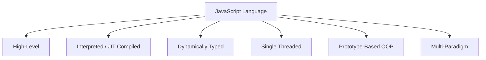

- **High-Level**: Memory management khud handle karta hai (Garbage Collection), developer ko manually memory allocate/deallocate nahi karni padti.
- **Dynamically Typed**: Variable ka type runtime pe decide hota hai. `let x = 5; x = "hello";` — valid hai, koi error nahi.
- **Single Threaded**: Ek time pe ek hi task execute hota hai (call stack ek hi hai), lekin Event Loop ki help se asynchronous behavior simulate karta hai.
- **Interpreted + JIT Compiled**: Modern JS engines (V8) code ko line-by-line interpret nahi karte — pehle parse karte hain, fir JIT (Just-In-Time) compile karte hain machine code me, performance ke liye.

---

## 2. Internal Working — How JavaScript Works

**JS Engine kya hota hai?**

JS Engine ek program hai jo JavaScript code ko samajhta hai aur execute karta hai. Har browser ka apna JS Engine hota hai:

| Browser | JS Engine |
|---------|-----------|
| Chrome, Edge, Node.js | **V8** (Google) |
| Firefox | SpiderMonkey (Mozilla) |
| Safari | JavaScriptCore (Apple) |

**V8 Engine — Internal Working (Most Asked in Interviews)**

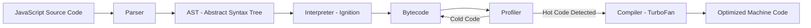

**Step by Step Process:**

1. **Parsing** — JS engine code ko padh kar tokens me todta hai, fir **AST (Abstract Syntax Tree)** banata hai — ek tree structure jo code ke structure ko represent karta hai.

2. **Compilation** — V8 do components use karta hai:
   - **Ignition (Interpreter)**: AST ko jaldi se **bytecode** me convert karta hai, code immediately run hone lagta hai (no waiting for full compilation).
   - **TurboFan (Optimizing Compiler)**: Jo code "hot" hota hai (baar-baar chalta hai, jaise loops), usko TurboFan optimize karke fast machine code me convert kar deta hai.

3. **Execution** — Bytecode/machine code, Call Stack aur Memory Heap ke through execute hota hai.

> Yeh approach **JIT (Just-In-Time) Compilation** kehlata hai — interpretation ki speed + compilation ki performance, dono ka combo.

**Parsing Deep Dive**

```javascript
let x = 10 + 5;
```

Parser isko tokens me todta hai: `let`, `x`, `=`, `10`, `+`, `5`, `;` — fir ek **AST** banata hai jisme har token ka meaning aur relationship defined hota hai (variable declaration, binary expression, etc).

---

## 3. Syntax

### Basic Syntax

```javascript
// Single line comment

/* Multi line
   comment */

let message = "Hello World";
console.log(message);
```

### Advanced Syntax — Strict Mode

```javascript
"use strict";

x = 10; // ❌ Error: x is not defined (strict mode me undeclared variable allowed nahi)
```

`"use strict"` JS ko ek strict version me run karta hai — silent errors ko throw errors bana deta hai, kuch unsafe actions block karta hai (jaise undeclared variables, duplicate parameters).

### Common Mistakes

| Mistake | Problem | Fix |
|---------|---------|-----|
| Semicolon missing reliance on ASI | ASI (Automatic Semicolon Insertion) kabhi-kabhi galat jagah semicolon laga deta hai | Hamesha explicitly `;` lagao |
| `==` use karna comparison ke liye | Type coercion ho jata hai, bugs aate hain | `===` use karo (strict equality) |
| Global variables accidentally banana | `x = 10` (bina let/const/var) global scope pollute karta hai | Hamesha `let`/`const` use karo |

---

## 4. Examples

**Beginner Example**

```javascript
console.log("Hello, Frontend World!");
```

**Intermediate Example**

```javascript
function greetUser(name) {
  return `Hello, ${name}! Welcome to JavaScript.`;
}
console.log(greetUser("Rahul"));
```

**Advanced Example — Engine Behavior Demo**

```javascript
// Yeh dikhata hai ki JS function ko pehle hoist karta hai (Memory Creation Phase)
console.log(square(5)); // 25 — kaam karega even though function neeche define hai

function square(num) {
  return num * num;
}
```

---

## 5. Interview Questions

**Easy**
1. JavaScript interpreted ya compiled language hai?
   - **Answer**: Dono — Modern JS Engines (V8) JIT compilation use karte hain, jo interpretation aur compilation dono ka mix hai.
2. ECMAScript kya hai?
   - **Answer**: ECMAScript JavaScript ka standard/specification hai jise ECMA International maintain karta hai. JavaScript is ECMAScript ka ek implementation hai.

**Medium**
3. V8 Engine me Ignition aur TurboFan ka kya role hai?
   - **Answer**: Ignition bytecode generate karta hai aur jaldi execution start karta hai. TurboFan hot/frequently-used code ko optimize karke fast machine code banata hai.

**Hard**
4. JavaScript single-threaded hai, phir async operations (setTimeout, fetch) kaise kaam karte hain?
   - **Answer**: JS engine khud single-threaded hai, lekin browser/runtime environment (Web APIs) alag threads provide karta hai background tasks ke liye. Event Loop unhe wapas main thread pe laata hai jab woh complete ho jaate hain. (Detail Section 14 me)

**Scenario Based**
5. Tumhe ek legacy codebase milta hai jisme `var` aur `==` har jagah use hua hai. Iske kya risks hain aur tum kya refactor karoge?
   - **Answer**: `var` function-scoped hai aur hoisting/redeclaration issues create karta hai; `==` type coercion se unexpected bugs deta hai. Refactor: `let`/`const` use karo block scoping ke liye, `===` use karo strict comparison ke liye, gradually migrate karo with testing.

---

## 6. Logical Questions

**Problem**: Bina kisi built-in function ke check karo ki JS engine "hot" code ko kaise treat karta hai — ek loop likho jo demonstrate kare ki repeated function calls performance pe asar daal sakte hain (conceptual, V8 ki internal optimization ki wajah se).

**Approach**: Same function ko bahut baar call karo loop me, V8's TurboFan usko optimize karega after detecting it's "hot".

```javascript
function add(a, b) {
  return a + b;
}

let result;
for (let i = 0; i < 1000000; i++) {
  result = add(i, i + 1); // V8 isko "hot" function maan kar optimize kar dega
}
console.log(result);
```

**Explanation**: Pehli kuch calls Ignition (interpreter) se chalti hain. Jab V8 detect karta hai ki `add` function baar-baar same pattern se call ho raha hai, TurboFan isko optimize karke machine code me convert kar deta hai — performance better ho jaati hai.

**Time Complexity**: O(n) — loop n baar chalta hai.
**Space Complexity**: O(1) — constant extra space.

---

## 7. Output-Based Questions

```javascript
console.log(typeof typeof 1);
```

**Output**: `"string"`

**Explanation**:
- `typeof 1` → `"number"` (a string value)
- `typeof "number"` → `"string"`

So step by step: inner `typeof 1` evaluates first to `"number"`, then outer `typeof "number"` evaluates to `"string"`.

---

## 8. Visual Diagram — JS Code Lifecycle

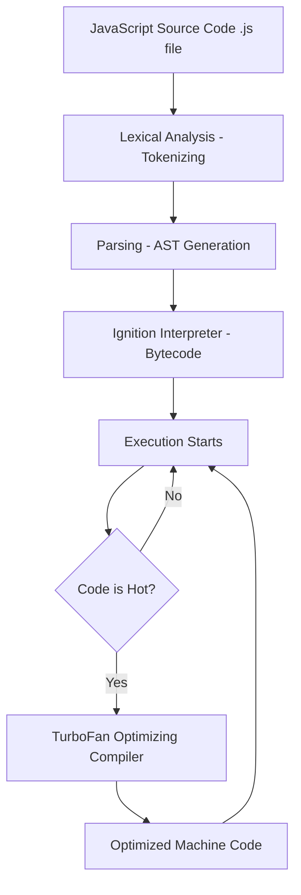

---

## 9. Revision Section

**Key Points**
- JavaScript = high-level, dynamically-typed, single-threaded, prototype-based language.
- ECMAScript = specification; JavaScript = implementation.
- V8 = Chrome/Node ka JS engine; uses Ignition (interpreter) + TurboFan (optimizing compiler) = JIT compilation.
- JS code lifecycle: Parsing → AST → Bytecode → Execution → (optional) Optimization.

**Common Mistakes**
- Java aur JavaScript ko related samajhna (galat hai, naam sirf marketing ke liye similar hai).
- Sochna ki JS purely interpreted hai (modern engines JIT use karte hain).

**Interview Notes**
- "JavaScript ka full internal flow batao" — yeh ek bahut common senior-level question hai. Parsing → AST → Ignition → Bytecode → TurboFan (if hot) flow yaad rakho.

**Quick Revision Table**

| Term | One-Line Meaning |
|------|-------------------|
| ECMAScript | JS ka official specification/standard |
| V8 | Google ka JS Engine (Chrome, Node.js) |
| Ignition | V8 ka interpreter (bytecode generate karta hai) |
| TurboFan | V8 ka optimizing compiler (hot code ko optimize karta hai) |
| JIT Compilation | Just-In-Time — interpretation + compilation ka combo |
| AST | Abstract Syntax Tree — code ka tree-structure representation |

---
---
# SECTION 2: Variables (var, let, const)

## 1. Introduction

**Variables kya hote hain?**

Variable ek **named container** hai jo data store karta hai memory me. JavaScript me variable declare karne ke 3 tareeke hain: `var`, `let`, `const`.

**Why is it needed?**

Bina variables ke, hum data ko reuse, update, ya track nahi kar sakte. Real example: e-commerce site pe "cart total" ek variable hai jo har item add/remove hone pe update hota hai.

**Real-world use case**
```javascript
let cartTotal = 0;
cartTotal += 499; // item 1 add
cartTotal += 999; // item 2 add
console.log(cartTotal); // 1498
```

---

## 2. Internal Working

Jab JS code run hota hai, **Execution Context** banta hai jisme do phases hote hain:

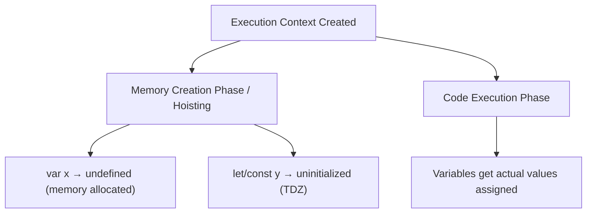

**Memory Creation Phase (Hoisting Phase)**:
- `var` declarations ko memory milti hai aur value `undefined` set hoti hai.
- `let` aur `const` declarations ko memory toh milti hai, lekin woh **Temporal Dead Zone (TDZ)** me rehte hain — access karne par `ReferenceError` aata hai.

**Code Execution Phase**:
- Line-by-line actual values assign hoti hain.

---

## 3. Syntax

### Basic Syntax

```javascript
var a = 10;     // function-scoped, re-declarable, re-assignable
let b = 20;     // block-scoped, re-assignable, NOT re-declarable in same scope
const c = 30;   // block-scoped, NOT re-assignable, NOT re-declarable
```

### Advanced Syntax

```javascript
// const object ki properties change ho sakti hain (reference fixed hai, content nahi)
const user = { name: "Aman" };
user.name = "Rohit"; // ✅ Valid
user = {};            // ❌ Error — reassignment of const
```

### Common Mistakes

| Mistake | Issue |
|---------|-------|
| Loop me `var` use karna closures ke saath | Sabhi closures same final value reference karte hain |
| `const` ko "immutable" samajhna | `const` sirf reference ko lock karta hai, object/array content mutate ho sakta hai |
| TDZ ko "let hoist nahi hota" samajhna | `let` bhi hoist hota hai, bas usable nahi hota TDZ ki wajah se |

---

## 4. Examples

**Beginner**
```javascript
var name = "Riya";
let age = 22;
const country = "India";
console.log(name, age, country);
```

**Intermediate — Scope Difference**
```javascript
function testVar() {
  if (true) {
    var x = 10;
  }
  console.log(x); // 10 — var function scoped hai, block ka effect nahi
}

function testLet() {
  if (true) {
    let y = 10;
  }
  console.log(y); // ReferenceError — let block scoped hai
}
```

**Advanced — Closures + Loop Problem**
```javascript
// Classic Interview Problem
for (var i = 0; i < 3; i++) {
  setTimeout(() => console.log(i), 100);
}
// Output: 3, 3, 3 (kyunki var function/global scoped hai, sabhi callbacks same 'i' use karte hain)

for (let j = 0; j < 3; j++) {
  setTimeout(() => console.log(j), 100);
}
// Output: 0, 1, 2 (kyunki let block scoped hai, har iteration ki apni 'j' hoti hai)
```

---

## 5. Interview Questions

**Easy**
1. `var`, `let`, aur `const` me kya difference hai?
   - **Answer**: `var` function-scoped + hoisted with `undefined` + re-declarable. `let`/`const` block-scoped + TDZ me rehte hain hoisting ke time. `const` reassign nahi ho sakta.

**Medium**
2. Kya `let` hoist hota hai?
   - **Answer**: Haan, `let` bhi hoist hota hai (memory allocate hoti hai), lekin woh **Temporal Dead Zone** me rehta hai jab tak actual declaration line execute na ho. Isliye access karne par `ReferenceError` aata hai, `undefined` nahi.

**Hard**
3. Kya `const` se declare kiya gaya array push operation se modify ho sakta hai?
   - **Answer**: Haan. `const` sirf **variable ke reference (binding)** ko immutable banata hai, value/content ko nahi. `const arr = [1,2]; arr.push(3);` valid hai, but `arr = [4,5]` invalid hai.

**Scenario Based**
4. Tumhe ek bug report milta hai: "loop ke andar event listeners sab same value dikha rahe hain." Tum kya debug karoge?
   - **Answer**: Most likely `var` use ho raha hai loop counter ke liye function-scope ki wajah se sab listeners same final value share kar rahe hain. Fix: `var` ko `let` se replace karo taaki har iteration ki apni scoped copy bane.

---

## 6. Logical Questions

**Problem**: Bina `let` use kiye, `var` ke saath ek loop likho jisme har iteration apna alag value capture kare (closure problem solve karna IIFE se).

**Approach**: IIFE (Immediately Invoked Function Expression) use karke har iteration ke `i` ko apne function scope me capture karo.

```javascript
for (var i = 0; i < 3; i++) {
  (function (capturedI) {
    setTimeout(() => console.log(capturedI), 100);
  })(i);
}
// Output: 0, 1, 2
```

**Explanation**: Har IIFE call apna naya function scope create karta hai jisme `capturedI` current `i` ki value le leta hai — isse closure problem solve ho jaata hai bina `let` use kiye.

**Time Complexity**: O(n)
**Space Complexity**: O(n) (n function scopes create hote hain)

---

## 7. Output-Based Questions

```javascript
console.log(a);
var a = 5;

console.log(b);
let b = 10;
```

**Output**:
```
undefined
ReferenceError: Cannot access 'b' before initialization
```

**Explanation**: `var a` hoisting phase me `undefined` set ho jaata hai, isliye first `console.log` `undefined` print karta hai bina error ke. `let b` bhi hoist hota hai but TDZ me hota hai — access karne par engine `ReferenceError` throw karta hai.

```javascript
{
  let x = 1;
  {
    let x = 2;
    console.log(x); // 2
  }
  console.log(x); // 1
}
```

**Explanation**: Block scoping ki wajah se inner `x` outer `x` ko shadow karta hai apne block ke andar. Block khatam hote hi outer `x` apni original value pe wapas aa jaata hai.

---

## 8. Visual Diagram — TDZ Visualization

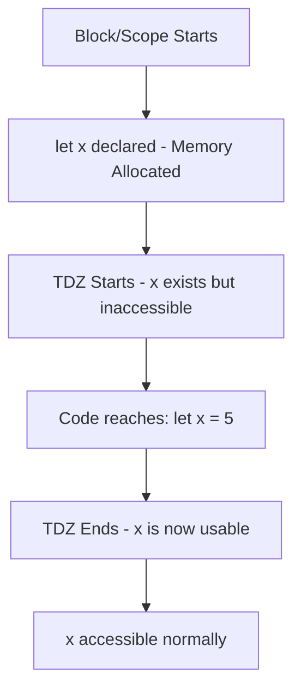

---

## 9. Revision Section

**Key Points**
- `var`: function-scoped, hoisted as `undefined`, re-declarable, re-assignable.
- `let`: block-scoped, hoisted but in TDZ, re-assignable, not re-declarable in same scope.
- `const`: block-scoped, hoisted but in TDZ, not re-assignable, reference is fixed (content mutable for objects/arrays).

**Common Mistakes**
- `var` ko loops me closures ke saath use karna.
- `const` arrays/objects ko "fully immutable" samajhna.

**Interview Notes**
- TDZ explain karte waqt yeh zaroor bolna: "let/const hoist hote hain, but unka access TDZ ki wajah se block hota hai jab tak declaration line execute na ho."

**Quick Revision Table**

| Feature | var | let | const |
|---------|-----|-----|-------|
| Scope | Function | Block | Block |
| Hoisting | Yes (`undefined`) | Yes (TDZ) | Yes (TDZ) |
| Re-declaration | Allowed | Not Allowed | Not Allowed |
| Re-assignment | Allowed | Allowed | Not Allowed |
| Global Object Property | Yes (in browser, `window.x`) | No | No |

---
---
# SECTION 3: Data Types

## 1. Introduction

**Data Types kya hote hain?**

Data type batata hai ki variable me kis kism ka data store hai — number, text, true/false, ya complex structure. JavaScript me data types do categories me bante hain: **Primitive** aur **Non-Primitive (Reference)**.

**Why is it needed?**
Compiler/Engine ko pata hona chahiye ki memory me kitni jagah allocate karni hai aur data ke saath kya operations valid hain (jaise number ko add kar sakte hain, string ko concatenate).

**Real-world use case**: Form validation — agar "age" field me string aa jaye number ki jagah, type checking se hum usse detect aur handle kar sakte hain.

---

## 2. Internal Working — Reference vs Value

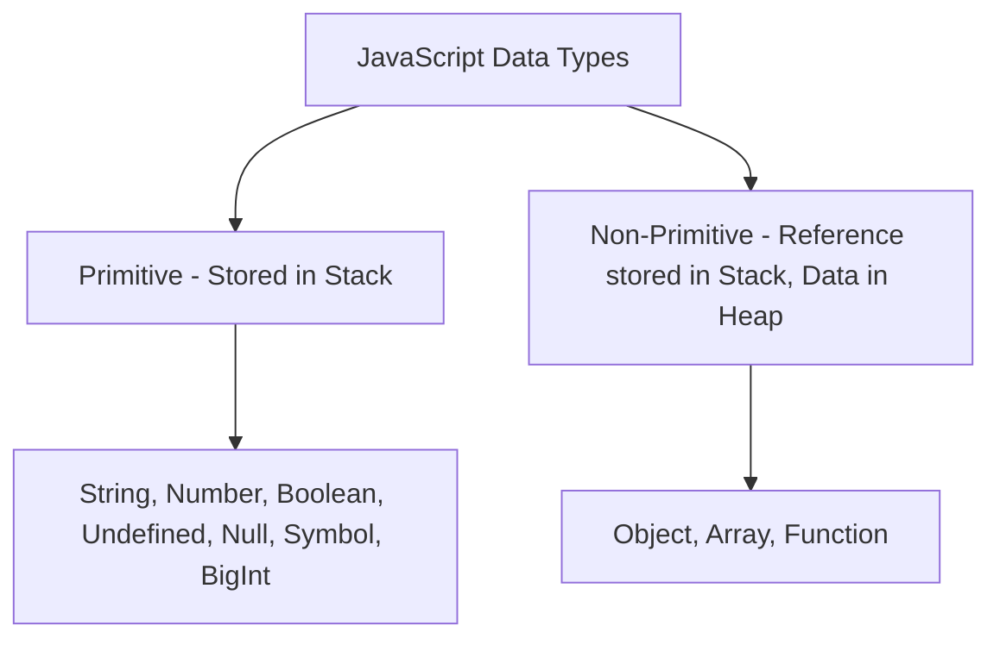

**Primitive Types** — Stack me directly value store hoti hai. Copy hone par **naya independent copy** banta hai.

**Non-Primitive Types** — Stack me sirf ek **reference (memory address)** store hota hai jo Heap me actual data ko point karta hai. Copy hone par reference copy hota hai, **same object share hota hai**.

```javascript
// Primitive - Value Copy
let a = 10;
let b = a;
b = 20;
console.log(a); // 10 (unaffected)

// Non-Primitive - Reference Copy
let obj1 = { value: 10 };
let obj2 = obj1;
obj2.value = 20;
console.log(obj1.value); // 20 (affected! same memory reference)
```

**Memory Diagram**

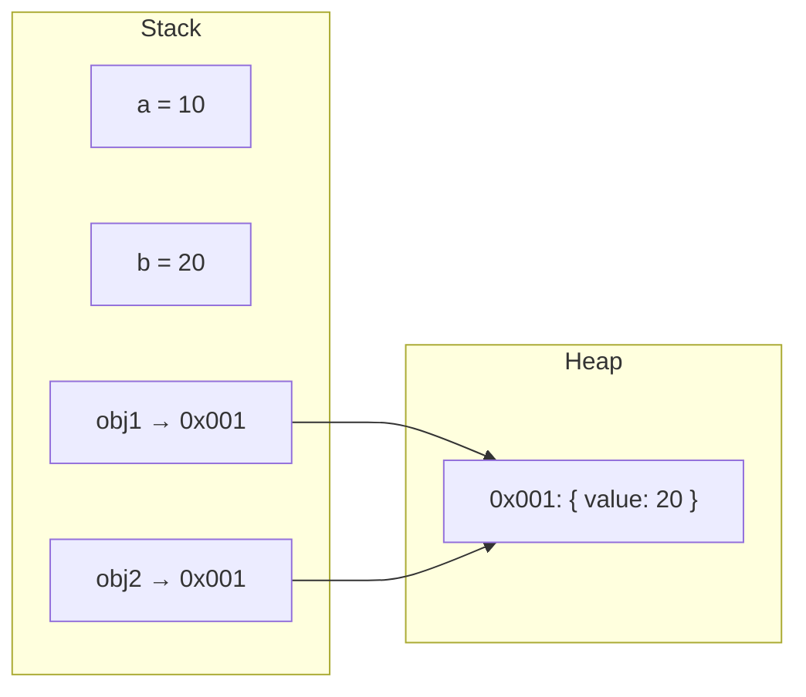

---

## 3. Syntax

### Primitive Types (7 total)

```javascript
let str = "Hello";          // String
let num = 42;                // Number
let isActive = true;         // Boolean
let notDefined;               // Undefined
let empty = null;             // Null
let sym = Symbol("id");       // Symbol
let big = 123456789012345678901234567890n; // BigInt
```

### Non-Primitive Types

```javascript
let arr = [1, 2, 3];                 // Array (type of object)
let obj = { name: "Aman" };          // Object
function greet() { return "Hi"; }    // Function (type of object)
```

### Common Mistakes

| Mistake | Explanation |
|---------|-------------|
| `typeof null` ko `"null"` samajhna | Actual output hai `"object"` — yeh JavaScript ka famous historic bug hai |
| `NaN === NaN` ko true samajhna | `NaN` apne aap ke equal bhi nahi hota — `Number.isNaN()` use karo check ke liye |
| Array ko primitive samajhna | Array actually `object` type ka hi hai (`typeof [] === "object"`) |

---

## 4. Examples

**Beginner**
```javascript
console.log(typeof "Hello");   // "string"
console.log(typeof 42);        // "number"
console.log(typeof true);      // "boolean"
console.log(typeof undefined); // "undefined"
console.log(typeof null);      // "object" (famous bug!)
console.log(typeof Symbol());  // "symbol"
console.log(typeof 10n);       // "bigint"
```

**Intermediate — Reference Behavior**
```javascript
function updateArray(arr) {
  arr.push(4);
}
let myArr = [1, 2, 3];
updateArray(myArr);
console.log(myArr); // [1, 2, 3, 4] — array reference se modified hua
```

**Advanced — Deep Equality Check Challenge**
```javascript
let userA = { name: "Aman", address: { city: "Delhi" } };
let userB = { name: "Aman", address: { city: "Delhi" } };

console.log(userA === userB); // false (different references in heap)
console.log(JSON.stringify(userA) === JSON.stringify(userB)); // true (content same)
```

---

## 5. Interview Questions

**Easy**
1. JavaScript me kitne primitive data types hain?
   - **Answer**: 7 — String, Number, Boolean, Undefined, Null, Symbol, BigInt.

**Medium**
2. `null` aur `undefined` me kya difference hai?
   - **Answer**: `undefined` matlab variable declare hua hai but value assign nahi hui (JS engine khud assign karta hai). `null` ek intentional "no value" hai jo developer explicitly assign karta hai.

**Hard**
3. `typeof null === "object"` kyun hai jabki `null` ek primitive type hai?
   - **Answer**: Yeh JavaScript ke earliest implementation (1995) ka historic bug hai. Internally values type tags ke saath store hote the, aur `null` ka representation accidentally object types ke saath match kar gaya (`0x00`). Backward compatibility ki wajah se yeh aaj tak fix nahi hua.

**Scenario Based**
4. Tumhe ek function pass karna hai jo object ko modify na kare (original safe rahe). Kya approach use karoge?
   - **Answer**: Object ka **shallow ya deep copy** banao (`{...obj}` ya `structuredClone(obj)`) function ko pass karne se pehle, taaki original reference affect na ho.

---

## 6. Logical Questions

**Problem**: Ek function likho jo check kare ki di gayi value primitive hai ya reference type.

**Approach**: `typeof` aur `null` check combine karke logic banao.

```javascript
function isPrimitive(value) {
  return value === null || (typeof value !== "object" && typeof value !== "function");
}

console.log(isPrimitive(42));        // true
console.log(isPrimitive("hello"));   // true
console.log(isPrimitive(null));      // true
console.log(isPrimitive({}));        // false
console.log(isPrimitive([1, 2]));    // false
```

**Explanation**: `typeof` reference types (object, array, function) ke liye `"object"` ya `"function"` return karta hai. `null` special case hai isliye explicitly check kiya.

**Time Complexity**: O(1)
**Space Complexity**: O(1)

---

## 7. Output-Based Questions

```javascript
console.log([] + []);
console.log([] + {});
console.log({} + []);
console.log(1 + "1");
console.log(1 + +"1");
```

**Output**:
```
""
"[object Object]"
"[object Object]"  (browser console) OR 0 (in some JS shells when {} treated as block)
"11"
2
```

**Step-by-step Explanation**:

1. `[] + []` → Dono array `toString()` se convert hote hain `""` (empty string) me, fir `"" + "" = ""`.
2. `[] + {}` → `[]` → `""`, `{}` → `"[object Object]"`, result: `"" + "[object Object]" = "[object Object]"`.
3. `{} + []` → Browser console me yeh `"[object Object]"` deta hai (addition expression ke roop me treat hota hai). Note: kuch JS environments (jaise Node REPL ya script ke start me) `{}` ko block statement samajh sakte hain aur sirf `+[]` evaluate karte hain jo `0` deta hai — yeh context-dependent hai.
4. `1 + "1"` → Number `1` ko string me convert kiya jaata hai (string concatenation priority), result: `"11"`.
5. `1 + +"1"` → `+"1"` unary plus operator string `"1"` ko number `1` me convert karta hai, fir `1 + 1 = 2`.

---

## 8. Visual Diagram — Data Types Hierarchy

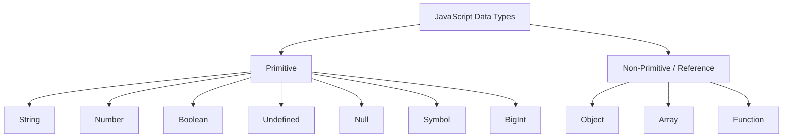

---

## 9. Revision Section

**Key Points**
- 7 Primitive types: String, Number, Boolean, Undefined, Null, Symbol, BigInt — Stack me store hote hain, copy by value.
- Non-Primitive (Object, Array, Function) — Heap me store hote hain, Stack sirf reference rakhta hai, copy by reference.
- `typeof null` → `"object"` (historic bug, yaad rakhna interview ke liye zaroori hai).

**Common Mistakes**
- `NaN === NaN` ko true samajhna (actually `false` hai).
- Array ko separate primitive type samajhna (yeh `object` hi hai).

**Interview Notes**
- "Reference vs Value" diagram banake explain karna interviewer ko impress karta hai — Stack/Heap dikhana zaroor.

**Quick Revision Table**

| Type | Category | typeof Result | Stored In |
|------|----------|----------------|-----------|
| String | Primitive | "string" | Stack |
| Number | Primitive | "number" | Stack |
| Boolean | Primitive | "boolean" | Stack |
| Undefined | Primitive | "undefined" | Stack |
| Null | Primitive | "object" (bug) | Stack |
| Symbol | Primitive | "symbol" | Stack |
| BigInt | Primitive | "bigint" | Stack |
| Object | Non-Primitive | "object" | Heap (ref in Stack) |
| Array | Non-Primitive | "object" | Heap (ref in Stack) |
| Function | Non-Primitive | "function" | Heap (ref in Stack) |

---
---
# SECTION 4: Operators

## 1. Introduction

**Operators kya hote hain?**

Operators woh symbols hain jo values/variables par operations perform karte hain — jaise math karna, comparison karna, ya logic apply karna.

**Why is it needed?**
Bina operators ke hum calculations, comparisons, conditional logic kuch nahi kar sakte. Real example: discount calculate karna (`price - discount`), ya login check karna (`username === storedUsername`).

---

## 2. Internal Working

JS operators **expressions** banate hain jo engine evaluate karta hai aur ek single value return karta hai. Operator precedence aur associativity decide karte hain ki complex expression me kaunsa operation pehle hoga.

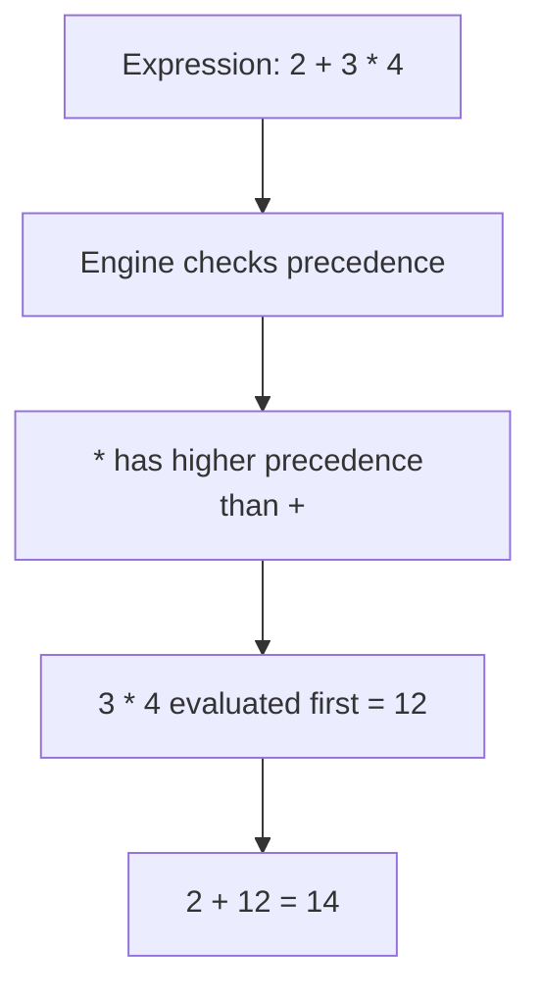

---

## 3. Syntax — All Operator Types

### Arithmetic Operators
```javascript
let a = 10, b = 3;
console.log(a + b);  // 13 - Addition
console.log(a - b);  // 7  - Subtraction
console.log(a * b);  // 30 - Multiplication
console.log(a / b);  // 3.333... - Division
console.log(a % b);  // 1  - Modulus (remainder)
console.log(a ** b); // 1000 - Exponentiation
```

### Assignment Operators
```javascript
let x = 10;
x += 5;  // x = x + 5  → 15
x -= 3;  // x = x - 3  → 12
x *= 2;  // x = x * 2  → 24
x /= 4;  // x = x / 4  → 6
x %= 4;  // x = x % 4  → 2
```

### Comparison Operators
```javascript
console.log(5 == "5");   // true  - loose equality (type coercion)
console.log(5 === "5");  // false - strict equality (no coercion)
console.log(5 != "5");   // false
console.log(5 !== "5");  // true
console.log(5 > 3);      // true
console.log(5 <= 5);     // true
```

### Logical Operators
```javascript
console.log(true && false); // false - AND
console.log(true || false); // true  - OR
console.log(!true);          // false - NOT
```

### Ternary Operator
```javascript
let age = 20;
let canVote = age >= 18 ? "Yes" : "No";
console.log(canVote); // "Yes"
```

### Nullish Coalescing (`??`)
```javascript
let userInput = null;
let defaultVal = userInput ?? "Default Value";
console.log(defaultVal); // "Default Value"

// Difference from || :
let count = 0;
console.log(count || 10); // 10 (0 is falsy, || triggers fallback)
console.log(count ?? 10); // 0  (?? only triggers on null/undefined, not other falsy values)
```

### Optional Chaining (`?.`)
```javascript
let user = { profile: { name: "Aman" } };
console.log(user?.profile?.name);    // "Aman"
console.log(user?.address?.city);    // undefined (no error, safely returns undefined)
```

### Common Mistakes

| Mistake | Issue |
|---------|-------|
| `==` use karna `===` ki jagah | Unexpected type coercion bugs |
| `||` aur `??` ko same samajhna | `||` falsy values (0, "", false) ko bhi replace karta hai; `??` sirf null/undefined ko |
| Operator precedence ignore karna | `2 + 3 * 4` ko `(2+3)*4` samajh lena galat hai |

---

## 4. Examples

**Beginner**
```javascript
let total = 100 + 50;
console.log(total); // 150
```

**Intermediate**
```javascript
let cart = { items: 3, discount: null };
let finalDiscount = cart.discount ?? 0;
console.log(finalDiscount); // 0
```

**Advanced — Chained Optional Chaining with Function Call**
```javascript
let api = {
  getUser: () => ({ name: "Riya" })
};
console.log(api.getUser?.()?.name);  // "Riya"
console.log(api.deleteUser?.()?.name); // undefined (function doesn't exist, no error thrown)
```

---

## 5. Interview Questions

**Easy**
1. `==` aur `===` me kya difference hai?
   - **Answer**: `==` (loose equality) comparison se pehle type conversion karta hai. `===` (strict equality) type aur value dono check karta hai bina conversion ke.

**Medium**
2. `??` aur `||` operator me kya difference hai?
   - **Answer**: `||` left operand ke **falsy** hone par right operand return karta hai (falsy = `0, "", false, null, undefined, NaN`). `??` sirf left operand `null` ya `undefined` hone par right operand return karta hai — baaki falsy values (`0`, `""`) ko valid maanta hai.

**Hard**
3. `1 + "1" + 1` aur `1 + 1 + "1"` ka output kya hoga aur kyun?
   - **Answer**: `1 + "1" + 1` → left-to-right evaluation: `1 + "1" = "11"`, fir `"11" + 1 = "111"`. `1 + 1 + "1"` → `1 + 1 = 2`, fir `2 + "1" = "21"`. Operator evaluation order (left to right) result decide karta hai.

**Scenario Based**
4. Tumhe API se response milta hai jisme nested objects ho sakte hain ya kuch fields missing ho sakte hain. Errors avoid karne ke liye kaunsa operator approach use karoge?
   - **Answer**: Optional chaining (`?.`) use karunga safe property access ke liye, aur nullish coalescing (`??`) use karunga default values provide karne ke liye missing data ke case me.

---

## 6. Logical Questions

**Problem**: Ek function likho jo do numbers ka safe division kare — agar divisor `0` ho toh `Infinity`/`NaN` ki jagah custom error message return kare, aur agar koi input `null`/`undefined` ho toh default value `0` use kare.

**Approach**: Nullish coalescing se defaults set karo, fir divisor zero check karo.

```javascript
function safeDivide(a, b) {
  a = a ?? 0;
  b = b ?? 0;
  if (b === 0) return "Error: Division by zero";
  return a / b;
}

console.log(safeDivide(10, 2));      // 5
console.log(safeDivide(10, 0));      // "Error: Division by zero"
console.log(safeDivide(null, 5));    // 0
```

**Explanation**: `??` operator ensure karta hai ki sirf `null`/`undefined` defaults trigger karein, `0` jaisi valid falsy value ko preserve karte hue.

**Time Complexity**: O(1)
**Space Complexity**: O(1)

---

## 7. Output-Based Questions

```javascript
console.log(null == undefined);  // true
console.log(null === undefined); // false
console.log(NaN == NaN);         // false
console.log(0 == "0");            // true
console.log(0 == "");             // true
console.log("" == "0");           // false
console.log(false == "false");   // false
console.log(false == 0);          // true
```

**Explanation**:
- `null == undefined` → `true` because loose equality specifically treats these two as equal to each other (special rule), but not equal to anything else.
- `NaN == NaN` → `false` — `NaN` kabhi apne aap ke bhi equal nahi hota, yeh IEEE 754 floating point standard ka rule hai.
- `0 == "0"` → `true` — string `"0"` number `0` me convert hoti hai comparison se pehle.
- `0 == ""` → `true` — empty string number me convert hoti hai `0` ban jaati hai.
- `"" == "0"` → `false` — dono strings hain, no coercion hota, content different hai.
- `false == "false"` → `false` — string `"false"` boolean me convert nahi hoti seedhe; coercion rules ke hisaab se yeh number comparison ban jaata hai aur `"false"` → `NaN`, jo `false` (0) ke equal nahi.
- `false == 0` → `true` — boolean `false` number `0` me convert hota hai.

---

## 8. Visual Diagram — Operator Precedence Flow

```mermaid
graph TD
A[Expression Evaluation] --> B[Parentheses - Highest Priority]
B --> C[Exponentiation **]
C --> D[Multiplication / Division / Modulus]
D --> E[Addition / Subtraction]
E --> F[Relational Comparisons]
F --> G[Equality == / ===]
G --> H[Logical AND &&]
H --> I[Logical OR ||]
I --> J[Ternary ?:]
J --> K[Assignment =]
```

---

## 9. Revision Section

**Key Points**
- `===` use karo always — type coercion bugs se bachne ke liye.
- `??` sirf `null`/`undefined` check karta hai; `||` sab falsy values check karta hai.
- Optional chaining `?.` errors prevent karta hai jab nested property exist nahi karti.

**Common Mistakes**
- `==` ka use production code me karna.
- `||` use karna jab `0` ek valid value ho sakti hai (use `??` instead).

**Interview Notes**
- `null == undefined` is `true` but `null === undefined` is `false` — yeh ek favorite trick question hai.

**Quick Revision Table**

| Operator | Purpose | Example |
|----------|---------|---------|
| `===` | Strict equality | `5 === "5"` → false |
| `==` | Loose equality (coercion) | `5 == "5"` → true |
| `??` | Nullish default | `null ?? 5` → 5 |
| `||` | Falsy default | `0 || 5` → 5 |
| `?.` | Safe property access | `obj?.prop` → undefined if missing |

---
---
# SECTION 5: Type Conversion

## 1. Introduction

**Type Conversion kya hai?**

Type Conversion woh process hai jisme JavaScript ek data type ki value ko doosre data type me convert karta hai — jaise string ko number me, ya number ko boolean me.

**Why is it needed?**
JS dynamically typed hai, isliye operations ke time engine ko decide karna padta hai ki types ko match karna hai ya nahi. Real-world: HTML form se aane wala input hamesha **string** hota hai, chahe user ne number type kiya ho — usse actual number me convert karna padta hai calculation ke liye.

```javascript
let inputValue = "25"; // form se aaya string
let age = Number(inputValue) + 5;
console.log(age); // 30
```

---

## 2. Internal Working

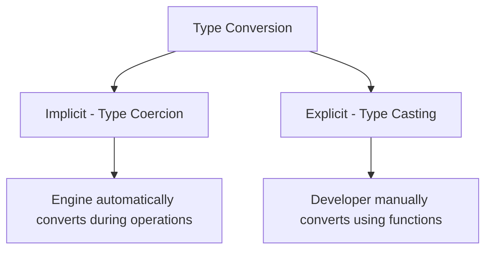

**Implicit Conversion (Type Coercion)** — JS engine automatically type convert karta hai operators ke context ke hisaab se (jaise `+` operator string concatenation ki taraf lean karta hai).

**Explicit Conversion (Type Casting)** — Developer manually `Number()`, `String()`, `Boolean()` functions use karta hai.

---

## 3. Syntax

### Explicit Conversion
```javascript
// To Number
console.log(Number("123"));   // 123
console.log(Number("abc"));   // NaN
console.log(Number(true));    // 1
console.log(Number(null));    // 0
console.log(Number(undefined)); // NaN

// To String
console.log(String(123));     // "123"
console.log(String(true));    // "true"
console.log(String(null));    // "null"

// To Boolean
console.log(Boolean(0));       // false
console.log(Boolean(""));      // false
console.log(Boolean("hello")); // true
console.log(Boolean(null));    // false
console.log(Boolean(undefined)); // false
console.log(Boolean(NaN));     // false
console.log(Boolean([]));      // true (empty array is truthy!)
console.log(Boolean({}));      // true (empty object is truthy!)
```

### Implicit Conversion
```javascript
console.log("5" + 3);   // "53" (number converted to string)
console.log("5" - 3);   // 2   (string converted to number)
console.log("5" * "2"); // 10  (both converted to numbers)
console.log(true + 1);  // 2   (boolean converted to number)
```

### Truthy & Falsy Values

**Falsy values (only 6 in JS):** `false`, `0`, `""` (empty string), `null`, `undefined`, `NaN`

**Everything else is Truthy** — including `"0"`, `"false"`, `[]`, `{}`, `-1`.

### Common Mistakes

| Mistake | Explanation |
|---------|-------------|
| `[]` ko falsy samajhna | Empty array/object **truthy** hote hain JS me |
| `"0"` string ko falsy samajhna | Non-empty string hamesha truthy hoti hai, even `"0"` |
| `parseInt` aur `Number` ko same samajhna | `parseInt("123abc")` → `123`, but `Number("123abc")` → `NaN` |

---

## 4. Examples

**Beginner**
```javascript
let result = "10" + 5; 
console.log(result); // "105"
```

**Intermediate**
```javascript
let formInput = "  42  ";
console.log(Number(formInput.trim())); // 42
```

**Advanced**
```javascript
function toSafeNumber(value) {
  const num = Number(value);
  return Number.isNaN(num) ? 0 : num;
}
console.log(toSafeNumber("99"));    // 99
console.log(toSafeNumber("abc"));   // 0
console.log(toSafeNumber(null));    // 0
```

---

## 5. Interview Questions

**Easy**
1. Implicit aur Explicit conversion me kya difference hai?
   - **Answer**: Implicit (coercion) automatically engine karta hai operation ke context se. Explicit (casting) developer manually `Number()`, `String()`, `Boolean()` se karta hai.

**Medium**
2. `parseInt` aur `Number` me kya difference hai?
   - **Answer**: `Number()` entire string ko valid number hone ki zaroorat hai, warna `NaN` deta hai. `parseInt()` string ko shuru se parse karta hai jab tak number characters milte hain, baaki ignore kar deta hai (`parseInt("42px")` → `42`).

**Hard**
3. `[] == false` ka output kya hoga aur kyun?
   - **Answer**: `true`. `[]` ko `==` comparison me primitive me convert kiya jaata hai → `[].toString()` → `""` → fir number me → `0`. `false` bhi `0` me convert hota hai. `0 == 0` → `true`.

**Scenario Based**
4. User input field se value aati hai jo empty string, `"0"`, ya actual number ho sakti hai. Tum kaise validate karoge ki value "present" hai (zero bhi valid input maana jaaye)?
   - **Answer**: `Boolean()` ya simple truthy check use nahi karunga (kyunki `0` falsy treat hoga). Instead `value !== "" && value !== null && value !== undefined` jaisa explicit check use karunga, ya `value.length > 0` (string ke liye).

---

## 6. Logical Questions

**Problem**: Ek function likho jo kisi bhi value ko safely Boolean me convert kare, lekin special handling kare empty array/object ke liye (treat them as "empty" → false), jo default JS behavior se different hai.

**Approach**: Custom truthy logic likho jo array/object ki length/keys check kare.

```javascript
function customBoolean(value) {
  if (Array.isArray(value)) return value.length > 0;
  if (typeof value === "object" && value !== null) return Object.keys(value).length > 0;
  return Boolean(value);
}

console.log(customBoolean([]));     // false (custom logic, JS default would be true)
console.log(customBoolean([1,2]));  // true
console.log(customBoolean({}));     // false
console.log(customBoolean(0));      // false
```

**Explanation**: Default JS `Boolean([])` `true` deta hai kyunki object reference truthy hai. Lekin business logic me kabhi-kabhi "empty array = no data = false" chahiye hota hai — yeh function woh custom behavior implement karta hai.

**Time Complexity**: O(n) for array/object (key/length check), O(1) for primitives.
**Space Complexity**: O(1)

---

## 7. Output-Based Questions (50 Tricky Questions)

```javascript
// 1
console.log(1 + "2");           // "12"
// 2
console.log("2" + 1);            // "21"
// 3
console.log(1 - "2");            // -1
// 4
console.log("5" - "2");          // 3
// 5
console.log("5" + + "2");        // "52" (unary + converts "2" to 2, but still concatenated as string... wait, let's verify)
```

> **Note on #5**: `"5" + +"2"` → `+"2"` evaluates first to number `2`. Then `"5" + 2` → string concatenation happens because left operand is string → `"52"`.

```javascript
// 6
console.log(true + true);        // 2
// 7
console.log(true + false);       // 1
// 8
console.log("true" == true);     // false
// 9
console.log([1,2] + [3,4]);      // "1,23,4"
// 10
console.log([] + 1);             // "1"
// 11
console.log(1 + null);           // 1
// 12
console.log(1 + undefined);      // NaN
// 13
console.log("5" * "2");          // 10
// 14
console.log("abc" * 2);          // NaN
// 15
console.log(null + null);        // 0
// 16
console.log(undefined + undefined); // NaN
// 17
console.log(null == 0);           // false
// 18
console.log(null >= 0);           // true (relational comparison converts null to 0)
// 19
console.log(NaN == NaN);          // false
// 20
console.log(NaN === NaN);         // false
// 21
console.log([1] == 1);            // true ([1] → "1" → 1)
// 22
console.log([1] == "1");          // true
// 23
console.log([] == []);            // false (different references)
// 24
console.log({} == {});            // false (different references)
// 25
console.log("" == 0);             // true
// 26
console.log(" " == 0);            // true (whitespace string converts to 0)
// 27
console.log(!!"");                // false
// 28
console.log(!!"0");               // true
// 29
console.log(!!0);                 // false
// 30
console.log(!![]);                // true
// 31
console.log(!!{});                 // true
// 32
console.log(10 == "10");           // true
// 33
console.log(10 === "10");          // false
// 34
console.log(0 == false);           // true
// 35
console.log(0 === false);          // false
// 36
console.log("0" == false);         // true
// 37
console.log(Number(""));           // 0
// 38
console.log(Number(" "));          // 0
// 39
console.log(Number("123abc"));     // NaN
// 40
console.log(parseInt("123abc"));   // 123
// 41
console.log(parseFloat("3.14abc"));// 3.14
// 42
console.log(String(null));         // "null"
// 43
console.log(String(undefined));    // "undefined"
// 44
console.log(String([1,2,3]));      // "1,2,3"
// 45
console.log(String({}));            // "[object Object]"
// 46
console.log(Boolean(" "));          // true (non-empty string with space is truthy)
// 47
console.log(Boolean(NaN));          // false
// 48
console.log(Boolean(-0));           // false
// 49
console.log(1 < 2 < 3);             // true ((1<2)=true → true is 1 → 1<3 → true)
// 50
console.log(3 > 2 > 1);             // false ((3>2)=true → 1 → 1>1 → false)
```

**Key explanation for tricky ones (#49, #50)**: Chained comparisons left-to-right evaluate hote hain. `1 < 2 < 3` → first `1 < 2` evaluates to `true` (boolean), then `true < 3` → `true` is coerced to `1`, so `1 < 3` → `true`. Similarly `3 > 2 > 1` → `3 > 2` is `true` → `1`, then `1 > 1` → `false`.

---

## 8. Visual Diagram — Coercion Decision Flow

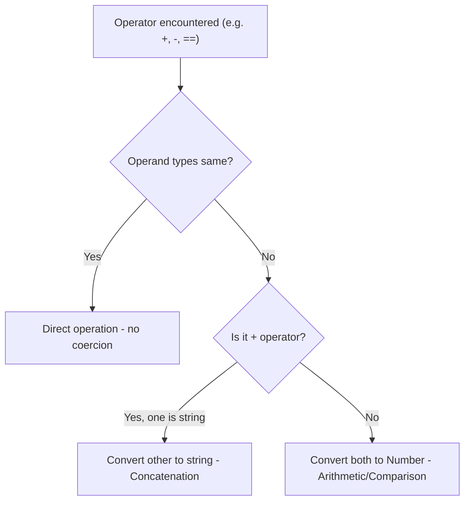

---

## 9. Revision Section

**Key Points**
- Only 6 falsy values: `false, 0, "", null, undefined, NaN`. Everything else truthy.
- `==` triggers type coercion; `===` doesn't.
- `+` operator string concatenation ki taraf priority deta hai agar koi bhi operand string ho.
- `-`, `*`, `/` always numeric conversion attempt karte hain.

**Common Mistakes**
- `[]` aur `{}` ko falsy samajhna.
- `parseInt`/`Number` ko interchangeable samajhna.

**Interview Notes**
- `console.log([] + [])`, `console.log([] + {})` jaise questions **bohot common** hain — step-by-step toString() conversion explain karna zaroori hai.

**Quick Revision Table**

| Value | Boolean Conversion |
|-------|---------------------|
| `0` | false |
| `""` | false |
| `null` | false |
| `undefined` | false |
| `NaN` | false |
| `false` | false |
| `"0"` | true |
| `[]` | true |
| `{}` | true |
| `-1` | true |

---
---
# SECTION 6: Functions

## 1. Introduction

**Function kya hai?**

Function ek reusable block of code hai jo specific task perform karta hai. Yeh input (parameters) leta hai aur output (return value) deta hai.

**Why is it needed?**
Code reusability, organization, aur DRY principle (Don't Repeat Yourself) ke liye. Real example: `calculateDiscount(price, percentage)` function har product pe reuse ho sakta hai bina logic dobara likhe.

---

## 2. Internal Working

Jab function call hota hai, ek naya **Execution Context** Call Stack pe push hota hai:

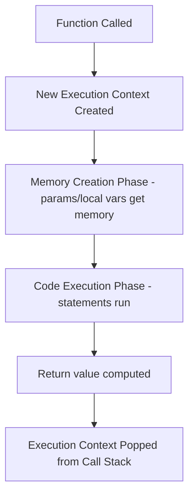

---

## 3. Syntax

### Function Declaration
```javascript
function greet(name) {
  return `Hello, ${name}`;
}
```
> Hoisted completely — call kar sakte ho declaration se pehle bhi.

### Function Expression
```javascript
const greet = function(name) {
  return `Hello, ${name}`;
};
```
> Hoisted as variable (TDZ ya `undefined` depending on var/let), function body call nahi ho sakti declaration se pehle.

### Anonymous Function
```javascript
setTimeout(function() {
  console.log("Executed after delay");
}, 1000);
```

### Arrow Functions
```javascript
const add = (a, b) => a + b;
const square = num => num * num;
const sayHi = () => console.log("Hi");
```
> Arrow functions ka apna `this` nahi hota — woh lexical scope se `this` inherit karte hain.

### IIFE (Immediately Invoked Function Expression)
```javascript
(function() {
  console.log("Runs immediately!");
})();

(() => {
  console.log("Arrow IIFE!");
})();
```

### Callback Functions
```javascript
function processData(data, callback) {
  const result = data * 2;
  callback(result);
}
processData(5, (result) => console.log(result)); // 10
```

### Higher Order Functions (HOF)
```javascript
// Function that takes another function as argument or returns a function
function multiplier(factor) {
  return function(num) {
    return num * factor;
  };
}
const double = multiplier(2);
console.log(double(5)); // 10
```

### Pure Functions
```javascript
// Pure - no side effects, same input always gives same output
function add(a, b) {
  return a + b;
}

// Impure - depends on/modifies external state
let total = 0;
function addToTotal(num) {
  total += num; // side effect
}
```

### Common Mistakes

| Mistake | Issue |
|---------|-------|
| Arrow function ko method ke roop me use karna object me | `this` object ko refer nahi karega, lexical scope (often `window`/`undefined`) ko karega |
| Function declaration aur expression ka hoisting confuse karna | Declaration fully hoisted; expression sirf variable part hoisted |
| Pure function me accidental side effect | Global variable modify karna function ke andar se |

---

## 4. Examples

**Beginner**
```javascript
function add(a, b) {
  return a + b;
}
console.log(add(3, 4)); // 7
```

**Intermediate — Closures with HOF**
```javascript
function createCounter() {
  let count = 0;
  return function() {
    count++;
    return count;
  };
}
const counter = createCounter();
console.log(counter()); // 1
console.log(counter()); // 2
```

**Advanced — Currying (HOF Pattern)**
```javascript
const curry = (fn) => {
  return function curried(...args) {
    if (args.length >= fn.length) {
      return fn.apply(this, args);
    }
    return (...nextArgs) => curried(...args, ...nextArgs);
  };
};

function multiply(a, b, c) {
  return a * b * c;
}
const curriedMultiply = curry(multiply);
console.log(curriedMultiply(2)(3)(4)); // 24
console.log(curriedMultiply(2, 3)(4)); // 24
```

---

## 5. Interview Questions

**Easy**
1. Function Declaration aur Function Expression me kya difference hai?
   - **Answer**: Declaration completely hoisted hota hai (call before define possible). Expression sirf variable declaration hoisted hota hai, function part nahi — call before define error deta hai.

**Medium**
2. Arrow function aur regular function me `this` ka behavior kaise different hai?
   - **Answer**: Regular function ka apna `this` hota hai jo call-time pe decide hota hai (kaun call kar raha hai). Arrow function ka apna `this` nahi hota — woh apne **lexical (surrounding) scope** se `this` inherit karta hai.

**Hard**
3. Higher Order Function kya hai, example do.
   - **Answer**: HOF woh function hai jo doosre function ko argument leta hai, ya function return karta hai. Examples: `map`, `filter`, `reduce` built-in HOFs hain.

**Scenario Based**
4. Tumhe ek event handler banana hai jo `this` se current button element access kare. Arrow function ya regular function — kya use karoge?
   - **Answer**: Regular function use karunga, kyunki event handlers me `this` ko triggering element (button) refer karna chahiye, jo regular function dynamically provide karta hai. Arrow function `this` lexical scope se lega jo galat element ho sakta hai.

---

## 6. Logical Questions

**Problem**: Ek `once(fn)` Higher Order Function likho jo ensure kare ki di gayi function sirf **ek baar** hi execute ho, baad ke calls me first result hi return ho.

**Approach**: Closure use karke flag aur cached result store karo.

```javascript
function once(fn) {
  let called = false;
  let result;
  return function(...args) {
    if (!called) {
      result = fn.apply(this, args);
      called = true;
    }
    return result;
  };
}

function initializeApp() {
  console.log("App Initialized!");
  return "Done";
}

const init = once(initializeApp);
init(); // "App Initialized!" logs, returns "Done"
init(); // nothing logs, returns "Done" (cached)
```

**Explanation**: Closure `called` aur `result` ko persist karta hai calls ke beech. Pehli call pe function actually run hota hai, baad ki calls cached result return karti hain.

**Time Complexity**: O(1) per call (after first)
**Space Complexity**: O(1)

---

## 7. Output-Based Questions

```javascript
function outer() {
  console.log(this);
}
outer(); // In non-strict mode browser: Window object. In strict mode: undefined.

const obj = {
  name: "Test",
  regularFn: function() { console.log(this.name); },
  arrowFn: () => { console.log(this.name); }
};
obj.regularFn(); // "Test" (this = obj)
obj.arrowFn();    // undefined (this = lexical scope, likely window/module scope, no 'name' property)
```

```javascript
console.log(typeof function(){}); // "function"
console.log(typeof (() => {}));    // "function"
console.log((function(){return 1;})()); // 1 - IIFE executes immediately
```

---

## 8. Visual Diagram — Function Call Flow

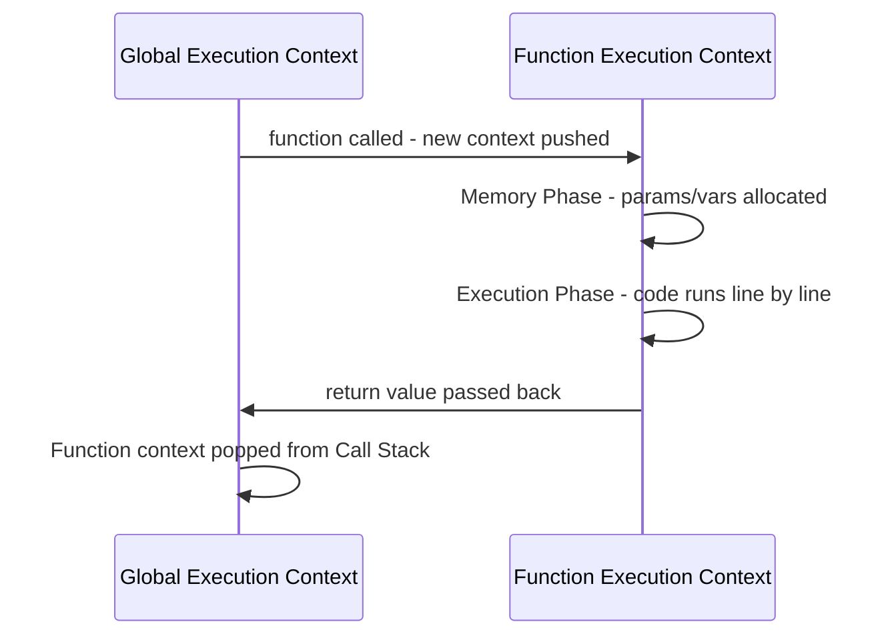

---

## 9. Revision Section

**Key Points**
- Function Declaration: fully hoisted, callable before definition.
- Function Expression: only variable hoisted, not callable before definition line.
- Arrow Functions: no own `this`, `arguments`, or `prototype`.
- HOFs: functions that take/return functions — backbone of functional programming (`map`, `filter`, `reduce`).
- Pure Functions: same input → same output, no side effects — essential for predictable code.

**Common Mistakes**
- Arrow functions ko object methods me use karna jab `this` object ko refer karna ho.
- IIFE ke around parentheses bhool jaana.

**Interview Notes**
- Currying aur `once()`/`memoize()` jaise HOF patterns bahut common coding round questions hote hain.

**Quick Revision Table**

| Type | Hoisting | Own `this` | Use Case |
|------|----------|------------|----------|
| Function Declaration | Fully hoisted | Yes | General reusable logic |
| Function Expression | Partially hoisted | Yes | Assigned to variables, conditional definitions |
| Arrow Function | Partially hoisted | No (lexical) | Callbacks, short functions, preserving outer `this` |
| IIFE | N/A | Yes (regular) / No (arrow) | One-time execution, module pattern |

---
---
 # SECTION 7: Scope & Closures

## 1. Introduction

**Scope kya hai?**

Scope decide karta hai ki kisi variable ko code ke kis hisse se access kiya ja sakta hai. JavaScript me scope ke types: Global, Function, Block, Lexical.

**Closure kya hai?**

Closure ek function hai jo apne **outer (lexical) scope ke variables ko yaad rakhta hai**, even after outer function execution complete ho jaaye.

**Why is it needed?**
- Scope: Variable naming conflicts avoid karta hai, data encapsulation deta hai.
- Closures: Private variables banana, state persist karna, memoization, module pattern — sab closures ki wajah se possible hai.

**Real-world use case**: Bank account balance ko private rakhna jisse sirf specific functions hi modify kar sakein — closure isko enable karta hai.

---

## 2. Internal Working

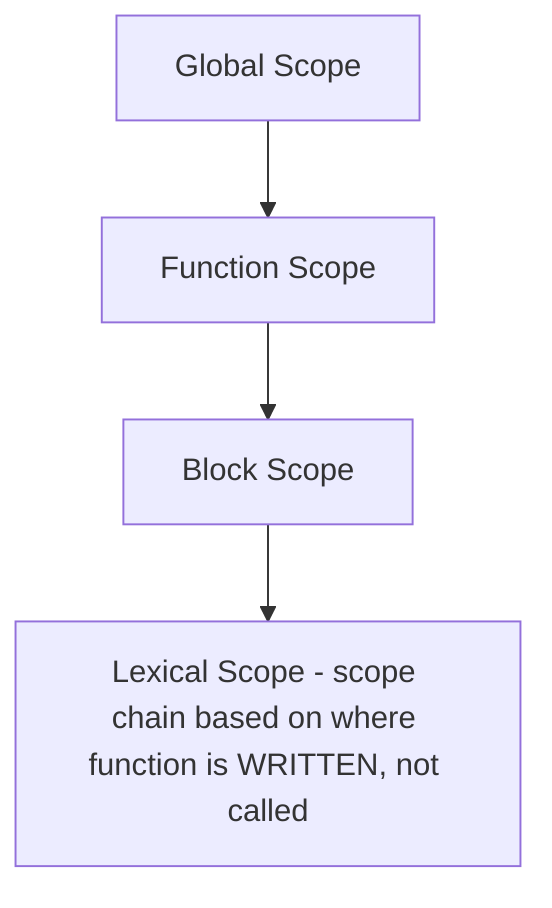

**Lexical Scope**: Function apne surrounding code ke scope ko access kar sakta hai jahan woh **define** hua tha, na ki jahan se woh **call** hua.

**Closure Memory Diagram**:

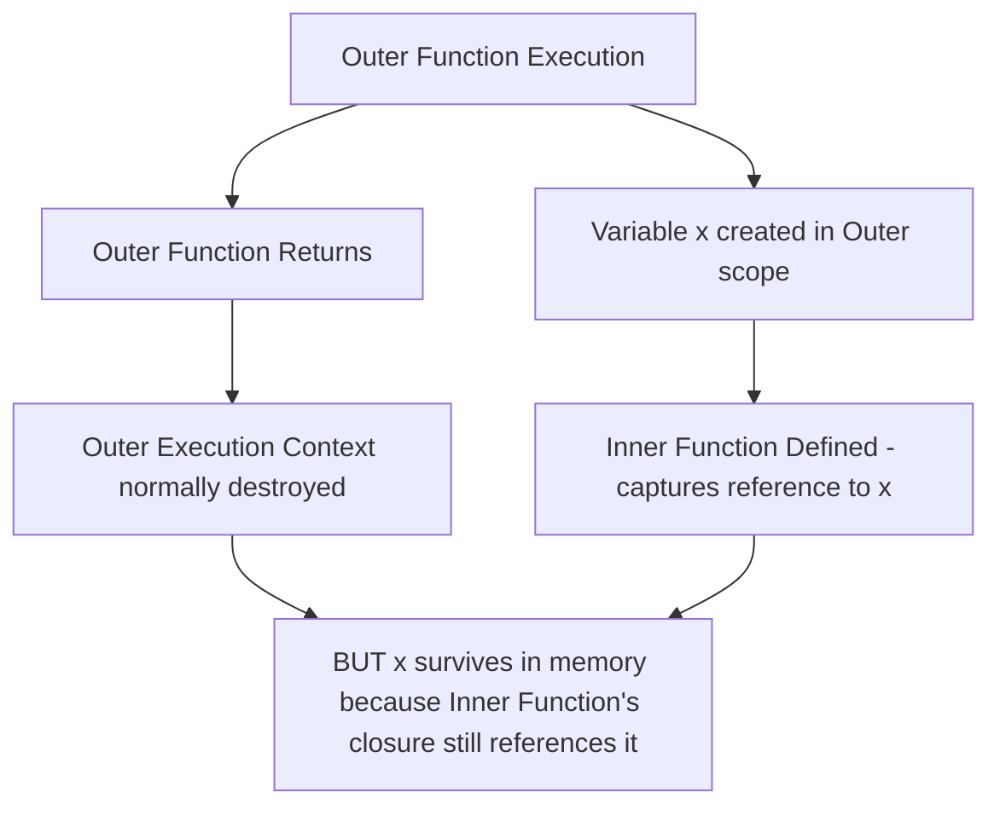

**Execution Flow**: Jab outer function return ho jaata hai, normally uska execution context garbage collected ho jaata hai. Lekin agar koi inner function (closure) us scope ke variables ko reference kar raha hai, JS engine unhe memory me **alive** rakhta hai jab tak closure exist karta hai.

---

## 3. Syntax

### Scope Types
```javascript
// Global Scope
let globalVar = "I am global";

function outer() {
  // Function Scope
  let functionVar = "I am function-scoped";
  
  if (true) {
    // Block Scope
    let blockVar = "I am block-scoped";
    console.log(blockVar); // accessible
  }
  // console.log(blockVar); // ❌ Error - not accessible here
}
```

### Closure Basic Syntax
```javascript
function outer() {
  let count = 0;
  function inner() {
    count++;
    return count;
  }
  return inner;
}
const increment = outer();
console.log(increment()); // 1
console.log(increment()); // 2
```

### Common Mistakes

| Mistake | Issue |
|---------|-------|
| Closures ko loops me galat use karna (`var` ke saath) | Sab closures same final variable reference karte hain |
| Memory leak risk | Closures unnecessarily large objects ko reference karke memory me hold kar sakte hain |
| Lexical scope ko dynamic scope samajhna | JS lexical scoping use karta hai — function definition location matter karti hai, call location nahi |

---

## 4. Examples

**Beginner**
```javascript
function greet() {
  let message = "Hello";
  function sayMessage() {
    console.log(message); // accessing outer variable
  }
  sayMessage();
}
greet(); // "Hello"
```

**Intermediate — Private Variables (Module Pattern)**
```javascript
function BankAccount(initialBalance) {
  let balance = initialBalance; // private, not accessible outside

  return {
    deposit(amount) {
      balance += amount;
      return balance;
    },
    withdraw(amount) {
      if (amount > balance) return "Insufficient funds";
      balance -= amount;
      return balance;
    },
    getBalance() {
      return balance;
    }
  };
}

const account = BankAccount(1000);
console.log(account.deposit(500));  // 1500
console.log(account.withdraw(200)); // 1300
console.log(account.balance);        // undefined - truly private!
```

**Advanced — Memoization using Closures**
```javascript
function memoize(fn) {
  const cache = {};
  return function(...args) {
    const key = JSON.stringify(args);
    if (cache[key]) {
      console.log("From cache");
      return cache[key];
    }
    const result = fn(...args);
    cache[key] = result;
    return result;
  };
}

function slowSquare(n) {
  for (let i = 0; i < 1e6; i++) {} // simulate slow operation
  return n * n;
}

const fastSquare = memoize(slowSquare);
console.log(fastSquare(5)); // calculates, caches
console.log(fastSquare(5)); // "From cache", instant
```

---

## 5. Interview Questions

**Easy**
1. Closure kya hota hai?
   - **Answer**: Closure ek function hai jo apne lexical scope ke variables ko "remember" karta hai, even after outer function return ho jaaye.

**Medium**
2. Lexical Scope kya hai?
   - **Answer**: Lexical scope yeh determine karta hai ki function definition ke time uske around konse variables accessible hain — scope function ke **likhe jaane ki jagah** se decide hota hai, call hone ki jagah se nahi.

**Hard**
3. Closures memory leaks kaise create kar sakte hain?
   - **Answer**: Agar closure unnecessarily large data structures (jaise bade arrays/DOM elements) ko reference karta rehta hai aur woh closure kabhi destroy nahi hota (jaise global reference me store ho jaaye), toh garbage collector usse clean nahi kar paata — memory leak ho jaata hai.

**Scenario Based**
4. Tumhe ek API rate-limiter banana hai jo track kare ki kitni baar function call hua hai aur limit cross hone par block kare. Kaunsa concept use karoge?
   - **Answer**: Closures use karunga — ek counter variable closure me maintain karunga jo persist rahe calls ke beech, aur limit check karke function ko allow/block karunga.

---

## 6. Logical Questions

**Problem**: Ek `debounce(fn, delay)` function likho closures use karke (yeh Section 20 me detail se aayega, yahan basic closure concept dikhayenge).

**Approach**: Closure me ek `timer` variable store karo jo har call pe reset ho.

```javascript
function debounce(fn, delay) {
  let timer; // closure variable - persists across calls
  return function(...args) {
    clearTimeout(timer);
    timer = setTimeout(() => fn.apply(this, args), delay);
  };
}

const log = debounce((msg) => console.log(msg), 300);
log("Hello"); // agar 300ms ke andar phir call hua, yeh cancel ho jayega
log("World"); // yeh chalega (assuming no more calls within 300ms)
```

**Explanation**: `timer` variable returned function ke closure me persist hota hai. Har naye call pe purana timer clear hota hai aur naya schedule hota hai — yeh closures ki state-persistence capability dikhata hai.

**Time Complexity**: O(1) per call
**Space Complexity**: O(1)

---

## 7. Output-Based Questions

```javascript
function createFunctions() {
  let functions = [];
  for (var i = 0; i < 3; i++) {
    functions.push(function() { return i; });
  }
  return functions;
}
const fns = createFunctions();
console.log(fns[0](), fns[1](), fns[2]()); // 3 3 3
```

**Explanation**: `var` function-scoped hai, isliye saare closures **same `i` variable** ko reference karte hain. Loop khatam hone ke baad `i` ki final value `3` hoti hai — sab functions wahi value dekhte hain.

```javascript
function createFunctionsFixed() {
  let functions = [];
  for (let i = 0; i < 3; i++) {
    functions.push(function() { return i; });
  }
  return functions;
}
const fns2 = createFunctionsFixed();
console.log(fns2[0](), fns2[1](), fns2[2]()); // 0 1 2
```

**Explanation**: `let` block-scoped hai — har iteration apna **naya `i`** banata hai, isliye har closure apni alag value capture karta hai.

---

## 8. Visual Diagram — Scope Chain

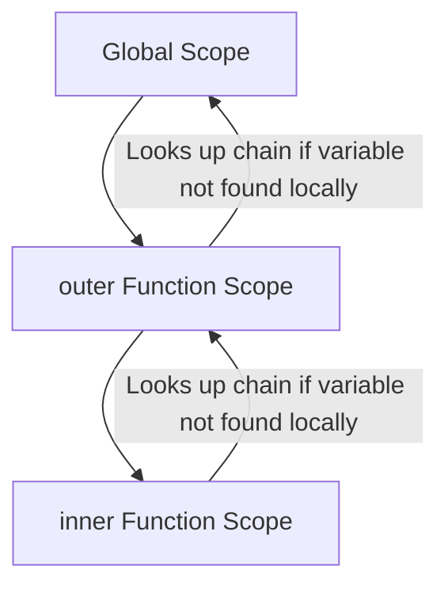

---

## 9. Revision Section

**Key Points**
- Scope types: Global, Function, Block, Lexical.
- Closures = Function + its lexical environment (remembered variables).
- Closures enable: private variables, memoization, currying, debounce/throttle, module pattern.

**Common Mistakes**
- `var` use karna loops me jab har iteration ki independent value chahiye ho.
- Closures ki wajah se accidental memory retention.

**Interview Notes**
- "createFunctions with var vs let" ek **extremely common** interview question hai — practice karna zaroori hai.

**Quick Revision Table**

| Concept | Meaning |
|---------|---------|
| Global Scope | Entire program me accessible |
| Function Scope | Sirf function ke andar accessible (`var`) |
| Block Scope | Sirf `{}` ke andar accessible (`let`/`const`) |
| Lexical Scope | Definition location decide karta hai accessibility |
| Closure | Function + remembered outer variables |

---
---
SECTIONEOF
wc -l /home/claude/JS-Frontend-Interview-Handbook.md
Output

# SECTION 9: `this` Keyword

## 1. Introduction

**`this` kya hai?**

`this` ek special keyword hai jo **current execution context** ke "owner" ko refer karta hai. Iski value **kaise function call hua** us par depend karti hai, na ki kahan function define hua (except arrow functions).

**Why is it needed?**
`this` allows the same function/method ko different objects ke context me reuse karna. Real example: ek generic `logInfo()` method jo har object ke apne data ko `this` se access kare.

---

## 2. Internal Working

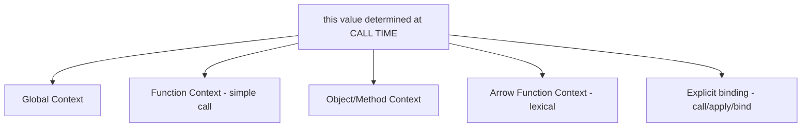

`this` ka value **call-site** pe decide hota hai (kaise function invoke hua), function definition pe nahi (arrow functions exception hain — woh lexical scope follow karte hain).

---

## 3. Syntax & Rules

### Global Context
```javascript
console.log(this); // Browser: Window object. Node module: {} (module.exports)

function showThis() {
  console.log(this); 
}
showThis(); // Non-strict: Window/global object. Strict mode: undefined
```

### Object/Method Context
```javascript
const user = {
  name: "Aman",
  greet() {
    console.log(this.name); // "Aman" - this = user (the object that called the method)
  }
};
user.greet();
```

### Arrow Function Context (Lexical `this`)
```javascript
const user2 = {
  name: "Riya",
  greet: () => {
    console.log(this.name); // undefined - arrow function takes 'this' from surrounding (outer) scope, not from user2
  }
};
user2.greet();
```

### Explicit Binding — call, apply, bind
```javascript
function introduce() {
  console.log(`I am ${this.name}`);
}

const person1 = { name: "Karan" };
introduce.call(person1);   // "I am Karan"
introduce.apply(person1);  // "I am Karan" (apply takes args as array)

const boundIntroduce = introduce.bind(person1);
boundIntroduce();           // "I am Karan" (this permanently bound)
```

### Common Mistakes

| Mistake | Issue |
|---------|-------|
| Arrow function ko object method banana jab `this` object refer karna ho | `this` object ko nahi, outer lexical scope ko refer karega |
| Nested regular function ke andar `this` lose ho jaana | Callback ke andar `this` global/undefined ho jaata hai unless arrow function ya bind use karein |
| `call` vs `apply` confuse karna arguments format ke liye | `call` comma-separated args leta hai, `apply` array leta hai |

---

## 4. Examples

**Beginner**
```javascript
const car = {
  brand: "Tesla",
  showBrand() {
    console.log(this.brand);
  }
};
car.showBrand(); // "Tesla"
```

**Intermediate — `this` Losing Context Problem**
```javascript
const car2 = {
  brand: "BMW",
  showBrand() {
    setTimeout(function() {
      console.log(this.brand); // undefined - regular function 'this' = global/window, not car2
    }, 100);
  }
};
car2.showBrand();
```

**Advanced — Fixing with Arrow Function or bind**
```javascript
const car3 = {
  brand: "Audi",
  showBrand() {
    setTimeout(() => {
      console.log(this.brand); // "Audi" - arrow function inherits 'this' from showBrand's scope
    }, 100);
  }
};
car3.showBrand();

// OR using bind:
const car4 = {
  brand: "Mercedes",
  showBrand() {
    setTimeout(function() {
      console.log(this.brand);
    }.bind(this), 100);
  }
};
car4.showBrand(); // "Mercedes"
```

---

## 5. Interview Questions

**Easy**
1. `this` ka value kaise decide hota hai?
   - **Answer**: Function **kaise call hua** uske basis pe (call-site), function definition pe nahi (except arrow functions, jo lexical `this` use karte hain).

**Medium**
2. `call`, `apply`, aur `bind` me kya difference hai?
   - **Answer**: Teeno `this` ko explicitly set karte hain. `call(thisArg, arg1, arg2...)` immediately invoke karta hai with comma-separated args. `apply(thisArg, [args])` immediately invoke karta hai with array of args. `bind(thisArg)` ek **naya function** return karta hai jisme `this` permanently bound hai, immediately call nahi karta.

**Hard**
3. Arrow function me `this` kaise resolve hota hai jab woh class method ke roop me define ho?
   - **Answer**: Arrow function ka apna `this` nahi hota — woh apne immediate **lexical (enclosing) scope** se `this` lete hain. Class ke andar arrow function property `this` ko class instance ke roop me capture karti hai (kyunki class body ka context constructor jaisa hota hai), isliye yeh callbacks me `this` preserve karne ka common pattern hai.

**Scenario Based**
4. Tumhe ek button click handler likhna hai jisme `this` button element ko refer kare, lekin tumhe ek nested setTimeout ke andar bhi same element access karna hai. Kaise likhoge?
   - **Answer**: Outer function regular function rakhunga (taaki `this` = button element ho event listener attach hone par), aur nested `setTimeout` ke andar **arrow function** use karunga taaki woh outer `this` (button) ko inherit kare.

```javascript
button.addEventListener("click", function() {
  console.log(this); // button element
  setTimeout(() => {
    console.log(this); // still button element (arrow inherits)
  }, 1000);
});
```

---

## 6. Logical Questions

**Problem**: Ek custom `bind` polyfill likho `this` keyword ka use karke (without using built-in `.bind()`).

**Approach**: `Function.prototype` pe custom method add karo jo closure se `this` aur args preserve kare.

```javascript
Function.prototype.myBind = function(context, ...presetArgs) {
  const originalFunction = this; // the function myBind is called on
  return function(...laterArgs) {
    return originalFunction.apply(context, [...presetArgs, ...laterArgs]);
  };
};

function greetPerson(greeting, name) {
  console.log(`${greeting}, ${name}! I am ${this.identity}`);
}

const ctx = { identity: "Bot" };
const boundGreet = greetPerson.myBind(ctx, "Hello");
boundGreet("Aman"); // "Hello, Aman! I am Bot"
```

**Explanation**: `myBind` `this` (original function reference) ko closure me capture karta hai, fir naya function return karta hai jo `apply` use karke context aur combined arguments ke saath original function call karta hai.

**Time Complexity**: O(n) where n = number of arguments
**Space Complexity**: O(n)

---

## 7. Output-Based Questions

```javascript
const obj = {
  name: "Test",
  getName: function() {
    return this.name;
  }
};

const getNameRef = obj.getName;
console.log(obj.getName()); // "Test" - called as method, this = obj
console.log(getNameRef());   // undefined - called standalone, this = global/undefined, no 'name' property
```

```javascript
class Counter {
  count = 0;
  increment = () => {
    this.count++;
    console.log(this.count);
  };
}
const c1 = new Counter();
const incrementRef = c1.increment;
incrementRef(); // 1 - works correctly! arrow function class property captures 'this' lexically at creation time (bound to instance)
```

---

## 8. Visual Diagram — `this` Resolution Flowchart

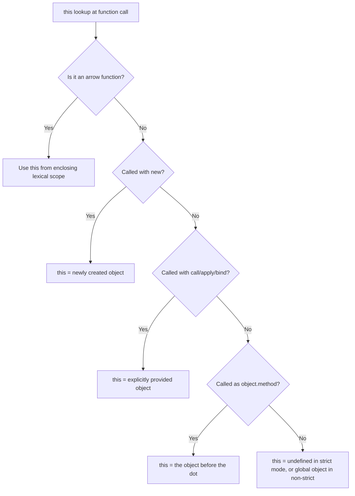

---

## 9. Revision Section

**Key Points**
- `this` call-time pe decide hota hai (except arrow functions — lexical).
- 4 Rules: Default (global/undefined), Implicit (object.method), Explicit (call/apply/bind), `new` binding (constructor).
- Arrow functions never have their own `this`.

**Common Mistakes**
- Method reference ko standalone variable me assign karke call karna (`this` lose ho jaata hai).
- Arrow functions ko object literal methods banana jab `this` object refer karna ho.

**Interview Notes**
- "4 Rules of this" explain karna ek strong structured answer deta hai: default binding, implicit binding, explicit binding, new binding — phir arrow function ka exception.

**Quick Revision Table**

| Context | `this` Value |
|---------|--------------|
| Global (non-strict) | Window/global object |
| Global (strict mode) | `undefined` |
| Object method call | The object before the dot |
| Standalone function call | `undefined` (strict) / global (non-strict) |
| Arrow function | Lexical scope's `this` |
| `call`/`apply`/`bind` | Explicitly provided object |
| Constructor (`new`) | Newly created instance |

---
---
SECTIONEOF
wc -l /home/claude/JS-Frontend-Interview-Handbook.md
Output

2428 /home/claude/JS-Fr


## 1. Introduction

**Array kya hai?**

Array ek ordered collection hai jo multiple values ko single variable me store karta hai. JavaScript me array dynamically sized hote hain aur mixed data types hold kar sakte hain.

**Why is it needed?**
List-based data manage karne ke liye — jaise products list, user list, todo items. Real example: e-commerce cart items ek array hota hai jisme har item ek object hota hai.

---

## 2. Internal Working

Arrays JS me **objects** hote hain internally, jisme indices keys ki tarah kaam karte hain. V8 engine arrays ko optimize karta hai special internal representations (packed arrays) ke through jab tak woh "holes" ya mixed types na rakhein.

```mermaid
graph TD
A[Array Declaration] --> B[Stored as Object internally]
B --> C[Indices = Keys: 0, 1, 2...]
B --> D[length property auto-maintained]
A --> E{Array type?}
E -->|All same type, no holes| F[V8: Fast - Packed Array]
E -->|Mixed types or holes| G[V8: Slower - Dictionary mode]
```

---

## 3. Array Methods — Full Coverage

### `push()` / `pop()` — End Operations
```javascript
let arr = [1, 2, 3];
arr.push(4);        // [1,2,3,4] - adds to end, returns new length
console.log(arr.pop()); // 4 - removes & returns last element
console.log(arr);   // [1,2,3]
```
**Interview Q**: Time complexity? → **O(1)** for both (no reindexing needed).

### `shift()` / `unshift()` — Start Operations
```javascript
let arr2 = [1, 2, 3];
arr2.unshift(0);    // [0,1,2,3] - adds to start
console.log(arr2.shift()); // 0 - removes & returns first element
console.log(arr2);  // [1,2,3]
```
**Interview Q**: Time complexity? → **O(n)** — sabhi elements ko reindex karna padta hai.

### `splice()` — Add/Remove Anywhere
```javascript
let arr3 = [1, 2, 3, 4, 5];
arr3.splice(1, 2);           // removes 2 elements from index 1: [1,4,5]
arr3.splice(1, 0, "a", "b"); // inserts at index 1 without removing: [1,"a","b",4,5]
```
**Mutates original array** — interview me bataना zaroori hai.

### `slice()` — Extract Without Mutating
```javascript
let arr4 = [1, 2, 3, 4, 5];
console.log(arr4.slice(1, 3)); // [2, 3] - extracts indices 1 to 2 (end excluded)
console.log(arr4);              // [1,2,3,4,5] - original unchanged
```

### `concat()` — Merge Arrays
```javascript
let a1 = [1, 2];
let a2 = [3, 4];
console.log(a1.concat(a2)); // [1,2,3,4] - new array, doesn't mutate
```

### `map()` — Transform Each Element
```javascript
let nums = [1, 2, 3];
let doubled = nums.map(n => n * 2);
console.log(doubled); // [2, 4, 6]
```

### `filter()` — Keep Matching Elements
```javascript
let nums2 = [1, 2, 3, 4, 5];
let evens = nums2.filter(n => n % 2 === 0);
console.log(evens); // [2, 4]
```

### `reduce()` — Accumulate to Single Value
```javascript
let nums3 = [1, 2, 3, 4];
let sum = nums3.reduce((acc, curr) => acc + curr, 0);
console.log(sum); // 10
```

### `find()` — First Matching Element
```javascript
let users = [{id:1,name:"A"},{id:2,name:"B"}];
let found = users.find(u => u.id === 2);
console.log(found); // {id:2, name:"B"}
```

### `some()` / `every()` — Boolean Checks
```javascript
let nums4 = [1, 2, 3, 4];
console.log(nums4.some(n => n > 3));  // true (at least one matches)
console.log(nums4.every(n => n > 0)); // true (all match)
```

### `sort()` — Sorting (Mutates Original!)
```javascript
let nums5 = [3, 1, 4, 1, 5];
nums5.sort((a, b) => a - b); // ascending: [1,1,3,4,5]
nums5.sort((a, b) => b - a); // descending: [5,4,3,1,1]

let words = ["banana", "apple", "cherry"];
words.sort(); // ["apple", "banana", "cherry"] - default lexicographic
```
**Common Trap**: `[10, 1, 2].sort()` without comparator → `[1, 10, 2]` (string-based sort, not numeric!).

### `flat()` — Flatten Nested Arrays
```javascript
let nested = [1, [2, 3], [4, [5, 6]]];
console.log(nested.flat());    // [1, 2, 3, 4, [5, 6]] - depth 1 default
console.log(nested.flat(2));   // [1, 2, 3, 4, 5, 6] - depth 2
console.log(nested.flat(Infinity)); // fully flattened
```

---

## 4. Examples

**Beginner**
```javascript
let fruits = ["apple", "banana"];
fruits.push("mango");
console.log(fruits); // ["apple", "banana", "mango"]
```

**Intermediate — Chaining Methods**
```javascript
let products = [
  { name: "Phone", price: 500, inStock: true },
  { name: "Laptop", price: 1000, inStock: false },
  { name: "Tablet", price: 300, inStock: true }
];

let availableNames = products
  .filter(p => p.inStock)
  .map(p => p.name);
console.log(availableNames); // ["Phone", "Tablet"]
```

**Advanced — Custom reduce-based groupBy**
```javascript
function groupBy(arr, key) {
  return arr.reduce((acc, item) => {
    const groupKey = item[key];
    if (!acc[groupKey]) acc[groupKey] = [];
    acc[groupKey].push(item);
    return acc;
  }, {});
}

let people = [
  { name: "A", dept: "IT" },
  { name: "B", dept: "HR" },
  { name: "C", dept: "IT" }
];
console.log(groupBy(people, "dept"));
// { IT: [{name:"A",dept:"IT"}, {name:"C",dept:"IT"}], HR: [{name:"B",dept:"HR"}] }
```

---

## 5. Interview Questions

**Easy**
1. `map()` aur `forEach()` me kya difference hai?
   - **Answer**: `map()` ek **naya array** return karta hai transformed values ke saath. `forEach()` `undefined` return karta hai — sirf iteration/side-effects ke liye use hota hai.

**Medium**
2. `slice()` aur `splice()` me kya difference hai?
   - **Answer**: `slice()` original array ko **mutate nahi** karta, naya array return karta hai (extraction). `splice()` original array ko **directly mutate** karta hai (add/remove elements).

**Hard**
3. `reduce()` use karke `map()` aur `filter()` dono ka kaam kaise kar sakte ho?
   - **Answer**: `reduce` ek generic accumulator pattern hai jisse koi bhi array transformation possible hai:
```javascript
let nums = [1,2,3,4,5];
// map equivalent
let doubled = nums.reduce((acc, n) => { acc.push(n*2); return acc; }, []);
// filter equivalent
let evens = nums.reduce((acc, n) => { if(n%2===0) acc.push(n); return acc; }, []);
```

**Scenario Based**
4. Tumhe 10,000 items ki list pe frequently filter+map+find operations karne hain performance-critical UI me. Kya optimize karoge?
   - **Answer**: Chaining `.filter().map()` multiple passes karta hai array pe — bade datasets ke liye `reduce()` me combine kar sakte hain single pass me. Memoization bhi use kar sakte hain repeated computations avoid karne ke liye, aur agar list static hai toh precompute karke cache kar sakte hain.

---

## 6. Logical Questions

**Problem**: Ek array me duplicate elements remove karo, original order preserve karte hue.

**Approach**: `Set` use karo (uniqueness guarantee) ya `filter` + `indexOf` combination.

```javascript
function removeDuplicates(arr) {
  return [...new Set(arr)];
}
console.log(removeDuplicates([1,2,2,3,4,4,5])); // [1,2,3,4,5]

// Alternative without Set:
function removeDuplicatesAlt(arr) {
  return arr.filter((item, index) => arr.indexOf(item) === index);
}
```

**Explanation**: `Set` automatically duplicate values discard karta hai insertion order preserve karte hue. Spread operator `[...set]` usse array me convert karta hai.

**Time Complexity**: O(n) with Set, O(n²) with filter+indexOf approach.
**Space Complexity**: O(n)

---

**Problem 2**: Array me se second largest number find karo bina sorting use kiye.

**Approach**: Single pass me largest aur second largest dono track karo.

```javascript
function secondLargest(arr) {
  let first = -Infinity, second = -Infinity;
  for (let num of arr) {
    if (num > first) {
      second = first;
      first = num;
    } else if (num > second && num !== first) {
      second = num;
    }
  }
  return second;
}
console.log(secondLargest([3, 1, 4, 1, 5, 9, 2])); // 5
```

**Explanation**: Ek hi loop me dono tracking variables (`first`, `second`) maintain karte hain — sorting (O(n log n)) ki zaroorat nahi.

**Time Complexity**: O(n)
**Space Complexity**: O(1)

---

## 7. Output-Based Questions

```javascript
console.log([1, 2, 3].map(String)); // ["1", "2", "3"]

console.log([1, [2, [3, [4]]]].flat(Infinity)); // [1, 2, 3, 4]

let arr = [1, 2, 3];
console.log(arr.length); // 3
arr[10] = 99;
console.log(arr.length); // 11 (sparse array - holes created)
console.log(arr);         // [1, 2, 3, <7 empty items>, 99]

console.log([1,2,3].sort((a,b) => b-a)); // [3,2,1]
console.log(typeof [1,2,3]); // "object"
console.log(Array.isArray([1,2,3])); // true
```

**Explanation**: `arr[10] = 99` directly assign karne se array ka length auto-update ho jaata hai (`11`), beech ke unassigned indices "holes" ban jaate hain (empty slots, `undefined` nahi exactly — they're skipped by methods like `map`/`forEach`).

---

## 8. Visual Diagram — Array Methods Categorization

```mermaid
graph TD
A[Array Methods] --> B[Mutating Original]
A --> C[Non-Mutating - Returns New]
B --> D[push, pop, shift, unshift, splice, sort, reverse]
C --> E[map, filter, slice, concat, flat]
A --> F[Iteration/Search]
F --> G[find, some, every, forEach, reduce]
```

---

## 9. Revision Section

**Key Points**
- Mutating methods: `push`, `pop`, `shift`, `unshift`, `splice`, `sort`, `reverse`.
- Non-mutating methods: `map`, `filter`, `slice`, `concat`, `flat`.
- `reduce()` is the most powerful/generic — can implement map, filter, even forEach logic.
- `sort()` default behavior is lexicographic (string-based) — always pass comparator for numbers.

**Common Mistakes**
- `slice` aur `splice` confuse karna.
- `sort()` ko bina comparator use karna numbers ke liye.
- Forgetting `sort()`, `reverse()`, `splice()` mutate the original array.

**Interview Notes**
- Array method ke time aur space complexity poochna common hai — `shift`/`unshift` = O(n), `push`/`pop` = O(1) yaad rakhna zaroori.

**Quick Revision Table**

| Method | Mutates? | Returns | Time Complexity |
|--------|----------|---------|------------------|
| `push` | Yes | New length | O(1) |
| `pop` | Yes | Removed element | O(1) |
| `shift` | Yes | Removed element | O(n) |
| `unshift` | Yes | New length | O(n) |
| `splice` | Yes | Removed elements array | O(n) |
| `slice` | No | New array | O(n) |
| `map` | No | New array | O(n) |
| `filter` | No | New array | O(n) |
| `reduce` | No | Accumulated value | O(n) |
| `sort` | Yes | Same array (sorted) | O(n log n) |
| `flat` | No | New flattened array | O(n) |

---
---
SECTIONEOF
wc -l /home/claude/JS-Frontend-Interview-Handbook.md

cat >> /home/claude/JS-Frontend-Interview-Handbook.md << 'SECTIONEOF'
# SECTION 11: Objects

## 1. Introduction

**Object kya hai?**

Object ek collection hai key-value pairs ka, jisme related data aur functionality (methods) ko ek single entity me group kiya jaata hai.

**Why is it needed?**
Real-world entities (user, product, order) ko represent karne ke liye structured way chahiye — object woh deta hai. Example: `{name: "Aman", age: 25, email: "a@x.com"}`.

---

## 2. Internal Working

Objects Heap memory me store hote hain, Stack me sirf reference hota hai. Internally V8 objects ko **hidden classes** ke through optimize karta hai property access fast karne ke liye.

```mermaid
graph TD
A[Object Created] --> B[Stored in Heap Memory]
B --> C[Reference stored in Stack]
A --> D[Properties stored as key-value pairs]
D --> E[V8 creates Hidden Class for fast property access]
```

---

## 3. Syntax

### Object Creation
```javascript
// Object literal (most common)
const user = { name: "Aman", age: 25 };

// Constructor function
function User(name, age) {
  this.name = name;
  this.age = age;
}
const user2 = new User("Riya", 22);

// Object.create
const user3 = Object.create({ greet() { return "Hi"; } });

// Class syntax (ES6)
class UserClass {
  constructor(name) {
    this.name = name;
  }
}
const user4 = new UserClass("Karan");
```

### Object Methods
```javascript
const person = { name: "Aman", age: 25, city: "Delhi" };

console.log(Object.keys(person));    // ["name", "age", "city"]
console.log(Object.values(person));  // ["Aman", 25, "Delhi"]
console.log(Object.entries(person)); // [["name","Aman"],["age",25],["city","Delhi"]]
console.log(Object.assign({}, person, { age: 26 })); // merges, age overridden
```

### Destructuring
```javascript
const { name, age } = person;
console.log(name, age); // "Aman" 25

// With renaming and defaults
const { name: fullName, country = "India" } = person;
console.log(fullName, country); // "Aman" "India"

// Nested destructuring
const data = { user: { profile: { city: "Mumbai" } } };
const { user: { profile: { city } } } = data;
console.log(city); // "Mumbai"
```

### Spread Operator
```javascript
const obj1 = { a: 1, b: 2 };
const obj2 = { ...obj1, c: 3 };
console.log(obj2); // { a: 1, b: 2, c: 3 }

// Useful for shallow cloning
const clone = { ...person };
```

### Object.freeze & Object.seal
```javascript
const frozenObj = Object.freeze({ x: 1 });
frozenObj.x = 100; // silently fails (or throws in strict mode)
console.log(frozenObj.x); // 1 - unchanged

const sealedObj = Object.seal({ y: 1 });
sealedObj.y = 100;   // ✅ allowed - can modify existing properties
sealedObj.z = 200;   // ❌ not allowed - cannot add new properties
console.log(sealedObj); // { y: 100 }
```

### Common Mistakes

| Mistake | Issue |
|---------|-------|
| `Object.freeze` ko deep freeze samajhna | Yeh sirf **shallow** freeze karta hai — nested objects still mutable rehte hain |
| Spread operator ko deep copy samajhna | Spread sirf **shallow copy** karta hai |
| Destructuring me default value ko `null` ke saath expect karna | Default value sirf `undefined` ke case me trigger hota hai, `null` me nahi |

---

## 4. Examples

**Beginner**
```javascript
const car = { brand: "Toyota", model: "Corolla" };
console.log(car.brand); // "Toyota"
console.log(car["model"]); // "Corolla"
```

**Intermediate — Deep Freeze Implementation**
```javascript
function deepFreeze(obj) {
  Object.keys(obj).forEach(key => {
    if (typeof obj[key] === "object" && obj[key] !== null) {
      deepFreeze(obj[key]);
    }
  });
  return Object.freeze(obj);
}

const nestedObj = deepFreeze({ a: 1, b: { c: 2 } });
nestedObj.b.c = 999; // fails silently
console.log(nestedObj.b.c); // 2 - truly frozen now
```

**Advanced — Deep Copy from Scratch**
```javascript
function deepClone(obj) {
  if (obj === null || typeof obj !== "object") return obj;
  if (Array.isArray(obj)) return obj.map(deepClone);
  
  const clonedObj = {};
  for (let key in obj) {
    if (obj.hasOwnProperty(key)) {
      clonedObj[key] = deepClone(obj[key]);
    }
  }
  return clonedObj;
}

const original = { a: 1, b: { c: 2, d: [3, 4] } };
const copy = deepClone(original);
copy.b.c = 999;
console.log(original.b.c); // 2 - unaffected, true deep copy
```

> **Modern alternative**: `structuredClone(obj)` — built-in deep clone (ES2022+), handles most cases including circular references.

---

## 5. Interview Questions

**Easy**
1. Shallow Copy aur Deep Copy me kya difference hai?
   - **Answer**: Shallow copy top-level properties ko copy karta hai, but nested objects same reference share karte hain (changes reflect both). Deep copy completely independent copy banata hai, nested objects bhi — koi shared reference nahi.

**Medium**
2. `Object.freeze()` aur `Object.seal()` me kya difference hai?
   - **Answer**: `freeze()` properties ko modify aur add/remove dono se rokta hai (fully immutable, shallow). `seal()` existing properties modify karne deta hai, but naye properties add/remove nahi hone deta.

**Hard**
3. `Object.assign({}, obj1, obj2)` aur `{...obj1, ...obj2}` me koi difference hai?
   - **Answer**: Functionally largely similar (shallow merge), lekin `Object.assign` getters/setters ko execute karta hai target object pe directly, jabki spread mostly similar behave karta hai modern engines me. Performance-wise spread thoda fast ho sakta hai modern engines me, but practically interchangeable hain most cases ke liye.

**Scenario Based**
4. Tumhe ek configuration object banana hai jo runtime me accidentally modify na ho sake (constants jaisa behave kare), including nested settings. Kya approach loge?
   - **Answer**: `deepFreeze()` use karunga (recursive `Object.freeze`) taaki top-level aur nested properties dono immutable ho jaayein, accidental mutations completely prevent ho.

---

## 6. Logical Questions

**Problem**: Do objects ko deeply compare karo (deep equality check) bina `JSON.stringify` use kiye (jo key order pe depend karta hai aur functions ko ignore karta hai).

**Approach**: Recursively har key-value pair compare karo.

```javascript
function deepEqual(obj1, obj2) {
  if (obj1 === obj2) return true;
  if (typeof obj1 !== "object" || typeof obj2 !== "object" || obj1 === null || obj2 === null) {
    return false;
  }
  const keys1 = Object.keys(obj1);
  const keys2 = Object.keys(obj2);
  if (keys1.length !== keys2.length) return false;
  
  return keys1.every(key => deepEqual(obj1[key], obj2[key]));
}

console.log(deepEqual({a:1,b:{c:2}}, {a:1,b:{c:2}})); // true
console.log(deepEqual({a:1,b:{c:2}}, {a:1,b:{c:3}})); // false
```

**Explanation**: Recursion se nested objects ko bhi compare karte hain. `keys1.every` ensure karta hai har property recursively match kare.

**Time Complexity**: O(n) where n = total number of properties (including nested).
**Space Complexity**: O(d) where d = depth of nesting (recursion stack).

---

## 7. Output-Based Questions

```javascript
const obj = { a: 1, b: 2 };
const obj2 = obj;
obj2.a = 100;
console.log(obj.a); // 100 - same reference

const obj3 = { ...obj };
obj3.a = 999;
console.log(obj.a); // 100 - unaffected, spread created new top-level object

const nested = { x: { y: 1 } };
const shallowCopy = { ...nested };
shallowCopy.x.y = 999;
console.log(nested.x.y); // 999 - affected! nested object reference still shared (shallow copy limitation)
```

```javascript
console.log(Object.keys({})); // []
console.log(Object.keys([1,2,3])); // ["0","1","2"] - array indices as string keys
console.log({} === {}); // false - different references
```

---

## 8. Visual Diagram — Shallow vs Deep Copy

```mermaid
graph TD
A[Original Object] --> B[Shallow Copy]
A --> C[Deep Copy]
B --> D[Top-level properties: independent]
B --> E[Nested objects: SAME reference shared]
C --> F[Top-level properties: independent]
C --> G[Nested objects: ALSO independent - fully cloned]
```

---

## 9. Revision Section

**Key Points**
- Object creation: literal, constructor function, `Object.create`, class syntax.
- Destructuring + spread are core ES6 features for working with objects cleanly.
- `Object.freeze`/`Object.seal` only work shallowly by default.
- Deep copy needed when nested mutation must be avoided — use `structuredClone()` or recursive clone function.

**Common Mistakes**
- Spread/`Object.assign` ko deep copy samajhna.
- `Object.freeze` ko nested objects pe bhi automatically apply hota samajhna.

**Interview Notes**
- "Implement deepClone from scratch" ek **very common** coding round question hai — practice zaroor karo.

**Quick Revision Table**

| Operation | Shallow or Deep | Method |
|-----------|------------------|--------|
| `{...obj}` | Shallow | Spread |
| `Object.assign({}, obj)` | Shallow | Assign |
| `JSON.parse(JSON.stringify(obj))` | Deep (but loses functions, undefined, etc.) | Stringify trick |
| `structuredClone(obj)` | Deep (modern, recommended) | Built-in |
| Custom recursive function | Deep (fully controllable) | Manual |

---
---
SECTIONEOF
wc -l /home/claude/JS-Frontend-Interview-Handbook.md


